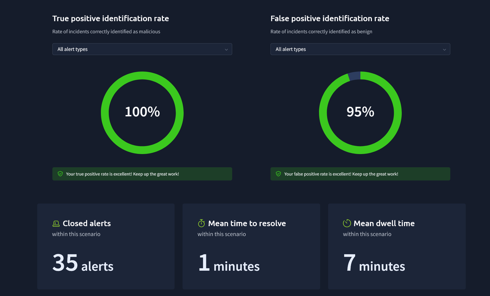

# SOC Alert Triage — PowerShell Intrusion and Suspected DNS Exfiltration

> **Environment:** Simulated SOC alert queue and Elastic SIEM | **Endpoint:** `win-3450` | **Focus:** Alert triage, process correlation, suspected data collection and exfiltration

## Executive Summary

This case study documents my investigation of related security alerts in a simulated Security Operations Center (SOC). The activity involved suspicious PowerShell processes, access to a financial-records network share, Robocopy file-collection commands, archive staging, and DNS queries consistent with possible data exfiltration.

Rather than classify each alert in isolation, I correlated process identifiers, command lines, file operations, and network observations to build an incident hypothesis. Investigation notes associated **PowerShell PID `3728`** with several stages of the suspected collection-and-exfiltration sequence. A separate PowerShell process, **PID `9060`**, was associated with creation of a `PowerView.ps1` file.

**Assessment:** The combined activity warranted true-positive classification and escalation in the simulation. The preserved artifacts do **not** establish the volume of financial data copied or confirm successful exfiltration.

## Scope and Evidence

The investigation sought to determine whether multiple alerts described a connected incident, what sensitive resources were targeted, and which findings were sufficiently supported to justify escalation.

Evidence retained from the exercise:

- Five screenshots documenting the alert queue, PowerView file creation, network-share mapping, Robocopy activity, and final simulator results.
- Investigation notes recording the wider PowerShell, staging, DNS, and Powercat activity.
- Selected Elastic SIEM alert and endpoint telemetry visible during the simulation.

The simulator ended immediately after a final batch of true-positive alerts was classified together. Consequently, some observations appear only in the notes, not in individual screenshots. This distinction is maintained throughout the report.

## Alert Triage and Initial Assessment

The investigation began in an alert queue that included phishing-related detection context. I reviewed the reported activity and associated evidence before deciding whether a detection warranted further investigation.

*Figure 1 — Initial alert queue and available triage actions in the simulated SOC.*

My triage approach was to identify the affected host and process, inspect supporting commands or telemetry, compare related alerts, and classify the behavior based on the combined evidence. As further PowerShell and file-operation alerts appeared on `win-3450`, I examined whether they formed a broader sequence rather than unrelated events.

## Endpoint Investigation

### PowerShell process correlation

Two process contexts stood out:

| Process | Recorded observation | Evidentiary boundary |
| --- | --- | --- |
| PowerShell PID `9060` | Creation of `PowerView.ps1` | File creation does not prove the script ran |
| PowerShell PID `3728` | Associated in investigation notes with staging, financial-share access, copying, and DNS activity | Full process ancestry and timestamps were not retained |

PID correlation is useful only with host and time context, since Windows may reuse PIDs. No parent-child relationship between these two PowerShell processes was established from the preserved evidence.

### PowerView artifact

An alert showed PowerShell PID `9060` associated with creation of `PowerView.ps1`. PowerView can be used to enumerate Active Directory objects and permissions, making its unexpected appearance worth investigating.

*Figure 2 — Endpoint evidence associating PowerShell PID `9060` with creation of `PowerView.ps1`.*

**Finding:** Suspicious reconnaissance preparation was observed. The screenshot does not confirm PowerView execution or successful directory enumeration.

### Financial network-share access

Process evidence showed `net.exe` commands used to map a drive to a financial-records network share. Although drive mapping is routine in many environments, this activity warranted scrutiny alongside the other suspicious PowerShell events.

*Figure 3 — Process evidence of network-drive mapping associated with the financial-records share.*

The command demonstrates an attempt to access the resource; it does not by itself prove the mapping succeeded or establish which files were accessible.

### File collection and staging

A later alert showed `Robocopy.exe` activity involving the financial-records share. Robocopy is a legitimate administrative tool, but its use in this context was consistent with attempted collection of sensitive files.

*Figure 4 — Robocopy process activity targeting financial-records data.*

Investigation notes also associated PID `3728` with creation of a local staging directory and preparation of a ZIP archive. These observations suggested packaging of collected data, but the complete directory contents, archive contents, copy results, and transfer volume were not preserved.

## Suspected Exfiltration and External Communication

### DNS activity

The contemporaneous notes describe repeated `nslookup.exe` activity involving `haz4rdw4re.io` and query names that appeared to contain encoded information. In combination with the collection and staging activity, the pattern raised concern about **DNS-based exfiltration**.

The preserved material does **not** include the DNS screenshot or decoded query contents. Therefore, this is a suspected exfiltration finding—not proof that the financial records were embedded in DNS requests or received by an external system.

### Powercat and external relay

The notes separately record Powercat-related activity involving `2.tcp.ngrok.io:19282`. Powercat can support remote TCP communication, but the notes do not independently confirm a working reverse shell, specific commands exchanged, or a link between this relay and the DNS activity.

### Correlated activity sequence

| Sequence | Observation | Interpretation |
| --- | --- | --- |
| 1 | Suspicious PowerShell activity | Possible initial post-compromise execution context |
| 2 | Financial-share drive-mapping command | Attempted access to sensitive data |
| 3 | Robocopy process activity | Possible bulk file collection |
| 4 | Local staging and ZIP preparation in notes | Possible data packaging |
| 5 | Repeated unusual DNS requests in notes | Suspected exfiltration channel |
| Parallel finding | Powercat and external relay in notes | Possible separate remote-communication channel |

This is the **investigative sequence reconstructed from the evidence**, not a fully timestamp-verified process tree. The combined behavior warranted escalation even though the outcome of each stage could not be independently verified.

## Alert Classification and Outcome

I classified alerts by considering the supporting process and network evidence, the affected host and resource, and relationships to other suspicious observations. Legitimate utilities such as PowerShell, `net.exe`, Robocopy, and `nslookup.exe` are not inherently malicious; their context and sequence informed the assessment.

During the final stage, multiple true-positive alerts arrived together and could be classified in a single action. That action completed the simulation before individual screenshots of those alerts were captured. The report does not reconstruct their missing details.

### Simulator-reported results

| Metric | Result |
| --- | ---: |
| True-positive identification | 100% |
| False-positive identification | 95% |
| Alerts closed | 35 |
| Mean time to resolve | 1 minute |
| Mean dwell time | 7 minutes |

*Figure 5 — Final simulator performance summary. Results apply to the training exercise, not a production SOC.*

**Disposition:** The related activity was treated as true-positive suspicious activity warranting escalation for possible unauthorized financial-data access and exfiltration. The exercise did not demonstrate production containment, eradication, or verified data loss.

## Detection Opportunities

The most useful defensive opportunity is to **correlate behaviors** rather than alert on the presence of individual administrative tools.

| Detection candidate | Suggested logic | Supporting telemetry |
| --- | --- | --- |
| Suspicious PowerShell or reconnaissance preparation | Unexpected PowerShell behavior or creation of scripts such as `PowerView.ps1` | Process and file creation; PowerShell logging |
| Unusual access to sensitive shares | New or unexpected drive mapping to financial shares | Process commands; SMB/share auditing; authentication logs |
| Possible bulk collection and staging | Robocopy activity followed by unusual archive creation | Process events; file-access and file-creation telemetry |
| Possible DNS exfiltration | Repeated anomalous queries, including long or encoded-looking subdomains, near suspicious collection activity | DNS resolver logs; endpoint process telemetry |
| Unauthorized external relay | Powercat-related commands or connections to unapproved relay infrastructure | PowerShell logs; endpoint and network connections |

**Proposed correlation:** Suspicious PowerShell activity → sensitive-share access → copying or archive staging → anomalous outbound DNS traffic on the same host within a defined time window. This is a recommended detection concept; it was **not** implemented or validated as a SIEM rule during the exercise.

## Response Recommendations

For an equivalent incident in a real environment, I would recommend the following, following the organization's escalation and evidence-handling procedures:

1. **Preserve and scope:** Retain SIEM alerts, process events, DNS logs, file-share audit records, and available endpoint evidence. Confirm process relationships using host, user, PID, and timestamps.
2. **Assess data exposure:** Identify the financial files accessed, verify Robocopy outcomes, and examine any staging directory or archive to determine the actual contents and volume involved.
3. **Investigate communications:** Analyze DNS queries for encoded payloads and destination patterns; investigate the Powercat relay independently to determine whether a remote session was established.
4. **Contain if confirmed:** Isolate affected systems where appropriate, revoke compromised access, and block verified malicious communications after necessary evidence preservation.
5. **Improve visibility:** Enable suitable PowerShell logging, sensitive-share auditing, DNS telemetry, and cross-source detections for collection-and-exfiltration behavior.

These are proposed actions, **not actions documented as performed** in the simulation.

## Evidence Limitations

| Finding | Available support | What remains unverified |
| --- | --- | --- |
| PowerView artifact | Figure 2 | Execution of `PowerView.ps1` |
| PowerShell PID correlation | Investigation notes | Complete event timeline and process ancestry |
| Financial-share mapping | Figure 3 | Successful access to all targeted files |
| Robocopy activity | Figure 4 | Copy completion, file inventory, or volume |
| Staging and ZIP preparation | Investigation notes | Archive contents and completed staging outcome |
| Suspected DNS exfiltration | Investigation notes | Full DNS evidence, decoded payload, and external receipt |
| Powercat relay | Investigation notes | Successfully established remote shell or session |
| Final classifications | Figure 5 and analyst account | Individual final-alert screenshots and separate case records |

**Analytical standard:** A command being launched does not necessarily prove it succeeded. An unusual network pattern does not establish successful data transfer. This case study therefore reports **suspected exfiltration**, not confirmed data loss.

## Skills Demonstrated

- **SOC operations:** Alert review, true-positive/false-positive disposition, prioritization, and escalation rationale.
- **Endpoint analysis:** PowerShell and PID correlation, file-creation evidence, drive mapping, and Robocopy investigation.
- **Network investigation:** DNS anomaly assessment, exfiltration hypotheses, and external relay indicators.
- **Incident reporting:** Multi-alert correlation, evidence limitations, detection recommendations, and response planning.

## Key Takeaway

The most important lesson was to interpret related alerts as a potential sequence. PowerShell execution, share mapping, Robocopy, and DNS lookups can each be legitimate; their combination around sensitive financial data warranted a higher-confidence investigation and escalation, even when the preserved artifacts could not prove successful exfiltration.
