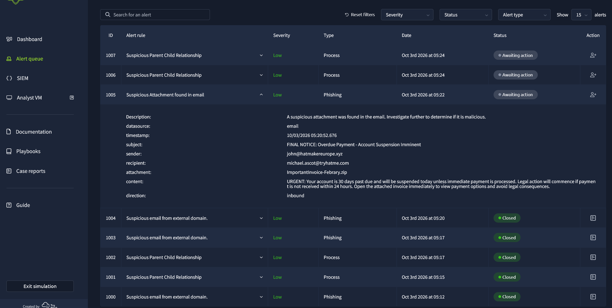
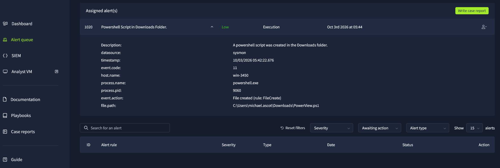
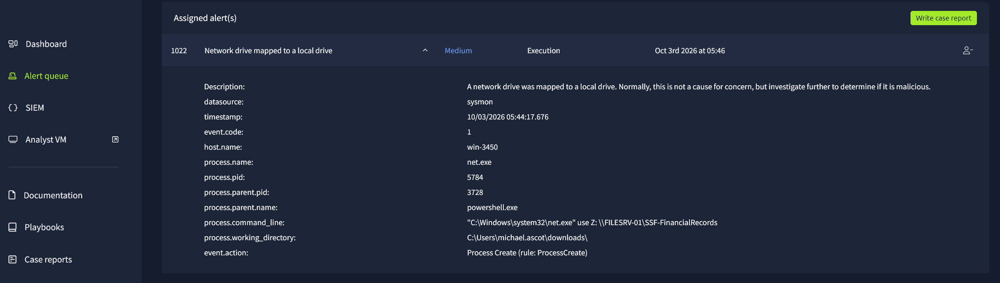
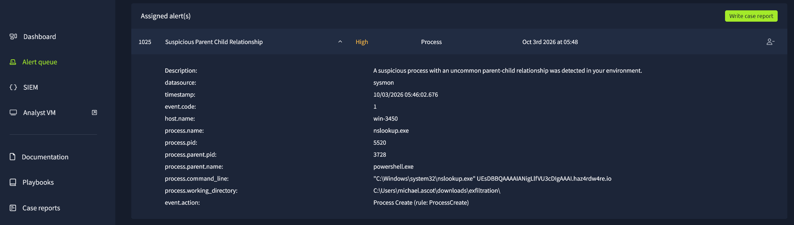

# SOC Alert Triage — PowerShell Intrusion and Suspected DNS Exfiltration

## Executive Summary

This project documents a simulated Security Operations Center (SOC) investigation involving suspicious PowerShell activity, network-share access, potential data staging, and DNS traffic consistent with a possible exfiltration attempt.

The investigation began with alerts presented through a SOC simulation environment. Rather than treating each alert as an isolated incident, I correlated endpoint activity to identify relationships between suspicious processes, file operations, network connections, and potential attacker objectives.

A central finding was the relationship between PowerShell process ID `3728` and several subsequent activities, including local directory creation, access to a financial records network share, file collection using Robocopy, and repeated DNS lookups.

Additional investigation notes identified Powercat-related activity involving an external relay destination and a separate PowerShell process creating a PowerView script.

The combined evidence supported an assessment of suspicious post-compromise activity involving potential data collection and exfiltration. However, the preserved evidence did not independently confirm that data was successfully received by an external destination.

The investigation demonstrates practical SOC responsibilities including alert prioritization, process correlation, event investigation, true-positive classification, and evidence-based escalation decisions.

## Investigation Scope

The investigation focused on determining whether multiple alerts represented unrelated system activity or a connected sequence of potentially malicious behavior.

The primary investigative questions were:

- What triggered the initial security alerts?
- Which processes were associated with suspicious activity?
- Could multiple alerts be correlated to a common execution context?
- Was sensitive information accessed or staged?
- Did the observed network activity indicate potential exfiltration?
- Which alerts warranted true-positive classification and escalation?
- What conclusions could be established from the preserved evidence?

### Investigation Environment

The analysis was conducted in a simulated SOC environment using an alert queue and Elastic SIEM telemetry.

Available evidence included:

- Security alert details and classifications
- Windows process activity and command-line information
- File-creation observations
- Network-share access and file-copy activity
- DNS-related investigation notes
- Screenshots of selected alert investigations
- Simulator performance results

The investigation centered on Windows endpoint `win-3450`, with process IDs and command-line activity used to correlate related events.

### Evidence Limitations

The simulator concluded after a final group of alerts was classified as true positive, leaving limited opportunity to preserve additional screenshots.

As a result, this report distinguishes between findings directly illustrated by preserved screenshots and observations recorded in contemporaneous investigation notes.

Where network activity suggested data exfiltration, the assessment is described as suspected rather than confirmed unless the supporting evidence established successful external data transfer.

The purpose of the case study is to demonstrate the investigative reasoning and alert-handling decisions made during the simulation, not to imply access to telemetry or response actions that were not preserved.

## Alert Triage and Initial Investigation

### Initial Alert Queue

The investigation began in a simulated SOC alert queue containing security detections requiring analyst review and classification.

The initial evidence included phishing-related alert context. Rather than making a classification based on the alert title alone, I examined the available alert details to understand the suspected activity and determine whether additional investigation was warranted.

The triage process focused on three questions:

1. **What triggered the alert?** Identify the reported activity, affected endpoint, and available indicators.
2. **What supporting evidence exists?** Review associated process, file, and network telemetry.
3. **Does the evidence justify escalation?** Determine whether the activity is benign, suspicious, or consistent with a genuine security incident.

*Figure 1 — Initial SOC simulation alert queue showing phishing-related detection context and available analyst triage actions.*

### Moving Beyond Individual Alerts

As additional detections appeared, the investigation expanded beyond the initial alert context.

Several alerts involved suspicious PowerShell activity and subsequent file-system or network operations on the Windows endpoint `win-3450`.

The investigation therefore shifted toward identifying relationships between the alerts rather than evaluating each detection independently.

Process identifiers, command-line arguments, affected resources, and event context were used to determine whether the detections could represent different stages of a connected intrusion.

### Investigation Approach

The analysis followed a repeatable SOC triage workflow:

| Stage | Analyst Activity | Purpose |
| --- | --- | --- |
| Alert Review | Examine detection details and affected systems | Establish initial context |
| Evidence Collection | Review associated endpoint and network telemetry | Identify supporting observations |
| Process Correlation | Compare process IDs and related commands | Connect potentially related events |
| Activity Assessment | Evaluate the behavior and possible attacker objectives | Determine whether activity is suspicious |
| Classification | Record true-positive or false-positive decisions | Resolve or escalate alerts based on evidence |
| Documentation | Preserve findings and supporting screenshots | Maintain a defensible investigation record |

### Initial Assessment

The alert queue was treated as the starting point of the investigation, not as proof that every detection represented a confirmed compromise.

The strongest investigative value came from correlating later PowerShell, file-access, and network activity.

That correlation is examined in the following sections, beginning with a PowerShell process that appeared repeatedly across the investigation.

## PowerShell Process Correlation

### Suspicious PowerShell Activity

As the investigation progressed, multiple alerts involved PowerShell activity on the Windows endpoint `win-3450`.

Rather than treating every PowerShell-related alert as a separate incident, I examined process identifiers, command-line arguments, and file-system activity to determine whether the events could be associated with a broader intrusion.

Two process contexts were significant:

| Process ID | Observed Activity | Investigative Significance |
| --- | --- | --- |
| `9060` | PowerShell-related creation of `PowerView.ps1` | Potential preparation for Active Directory reconnaissance |
| `3728` | PowerShell activity associated with later file collection and network operations | Common execution context connecting multiple suspicious alerts |

These observations suggested different roles within the activity, but the preserved evidence did not independently establish a parent-child relationship between the two PowerShell processes.

### PowerView Script Creation

One alert identified PowerShell process ID `9060` creating a file named `PowerView.ps1`.

PowerView is a PowerShell-based tool commonly associated with Active Directory enumeration. In an enterprise environment, its unexpected presence warrants investigation because it can support discovery of domain users, groups, computers, permissions, and other directory resources.

*Figure 2 — Endpoint telemetry showing PowerShell process ID `9060` associated with creation of `PowerView.ps1` on `win-3450`.*

The creation of this file was suspicious in the context of the broader alert sequence. However, a file-creation event does not independently prove that the script executed or that Active Directory reconnaissance successfully occurred.

The finding was therefore documented as **suspected reconnaissance preparation**, rather than confirmed execution of PowerView.

### Identifying a Common Process Context

A separate PowerShell process, PID `3728`, appeared in the investigation notes alongside multiple subsequent activities.

Those activities included:

- Creation of a local directory potentially used for staging collected data.
- Access to a network share containing financial records.
- File-copy activity involving Robocopy.
- Preparation of a ZIP archive.
- Repeated DNS lookups requiring investigation for possible data exfiltration.

The recurrence of the same process identifier provided a useful pivot for correlating activity that might otherwise appear as unrelated alerts.

However, a matching PID is meaningful only when evaluated with the endpoint identity and event timeframe, because Windows can reuse process identifiers.

### Analyst Assessment

The evidence supported two separate observations.

**PowerShell PID 9060:** A potentially suspicious PowerView script was created. The preserved screenshot did not prove subsequent execution.

**PowerShell PID 3728:** Investigation notes connected this process context to a sequence of file and network operations consistent with possible data collection and exfiltration.

The strongest conclusion was not that every PowerShell event represented a separate compromise, but that the observed activity warranted further investigation as a potentially connected incident.

The following sections examine the financial network-share access, file collection, and suspected exfiltration activity associated with the investigation.

## Financial Network Share Access and Data Collection

### Suspicious Network Share Access

The investigation identified activity involving a network share containing financial records.

Process evidence showed `net.exe` being used to map a network drive on the Windows endpoint `win-3450`.

Drive mapping is a legitimate administrative capability, but its appearance alongside suspicious PowerShell activity and subsequent file-copy operations warranted additional investigation.

*Figure 3 — Endpoint process evidence showing `net.exe` drive-mapping activity associated with access to a financial records network share.*

The network-share activity was significant because it provided a potential path for accessing data outside the compromised endpoint.

The observed command helped establish the intended resource and access method. However, process-creation telemetry alone did not confirm that the mapped drive was successfully established or that every file in the share was accessible.

### Financial Records Collection

Additional evidence showed `Robocopy.exe` activity involving the financial records share.

Robocopy is a legitimate Windows file-copy utility commonly used for backup, migration, and administrative operations.

In this investigation, its significance came from the surrounding activity: suspicious PowerShell execution, network-share mapping, and later observations involving data staging and potential exfiltration.

*Figure 4 — Process evidence showing Robocopy activity involving the financial records network share during the suspicious PowerShell investigation.*

The Robocopy command was consistent with an attempt to collect or copy financial files.

The preserved screenshot established the execution of file-copy tooling, but did not independently verify the number of files successfully transferred or the total volume of data collected.

### Local Data Staging

The investigation notes also associated PowerShell PID `3728` with the creation of a local staging directory and subsequent ZIP archive preparation.

These activities were considered alongside the network-share access and Robocopy execution.

The resulting sequence suggested an attempt to consolidate information before transferring it elsewhere:

1. Prepare a local directory for collected data.
2. Access the financial records network share.
3. Execute Robocopy against the financial records.
4. Prepare an archive potentially containing collected material.
5. Initiate additional network activity requiring exfiltration analysis.

This represents an investigative reconstruction based on the preserved notes and screenshots, not independent proof that every stage successfully completed.

### Analyst Assessment

The combined activity was suspicious because multiple data-access and collection behaviors occurred within the same broader PowerShell investigation.

A network drive-mapping command or Robocopy execution would not ordinarily justify a malicious classification on its own.

However, their appearance alongside suspected attacker-controlled PowerShell activity, local staging, and later unusual DNS requests supported escalation for possible unauthorized data collection.

**Finding:** The preserved evidence supported suspected financial-data collection and staging activity, but did not independently establish the complete contents or quantity of files successfully collected.

## Suspected DNS Exfiltration and External Communication

### Suspicious DNS Activity

Following the financial-share access, file-copy activity, and local data staging, the investigation notes documented repeated execution of `nslookup.exe`.

The observed DNS queries involved the external domain:

`haz4rdw4re.io`

The recorded query content appeared to contain encoded data, raising concern that DNS requests were being used to transmit information outside the environment.

DNS tunneling and exfiltration techniques can abuse the normal domain-resolution process by embedding data into DNS query names.

In this investigation, the concern was strengthened by the surrounding activity: suspicious PowerShell execution, financial records collection, and ZIP archive preparation.

### Process Correlation

The investigation notes associated the suspicious DNS activity with the broader sequence involving PowerShell PID `3728`.

This provided a potential relationship between data collection and subsequent outbound communication.

The reconstructed activity was:

| Stage | Recorded Observation | Investigative Significance |
| --- | --- | --- |
| 1 | Local staging directory created | Potential preparation for collecting files |
| 2 | Financial network share accessed | Access to potentially sensitive business information |
| 3 | Robocopy executed | Possible collection of financial records |
| 4 | ZIP archive prepared | Potential consolidation of collected data |
| 5 | Repeated `nslookup.exe` activity | Possible transfer of encoded data through DNS |

The sequence was consistent with a suspected data-exfiltration workflow.

However, the preserved evidence did not independently establish that the DNS requests contained the financial records or that a remote system successfully received the data.

### Additional Powercat Activity

The investigation notes also recorded suspicious Powercat-related activity involving the external relay destination:

`2.tcp.ngrok.io:19282`

Powercat is a PowerShell-based networking utility that can establish TCP connections and support remote command execution or data transfer.

The presence of Powercat-related activity and an external relay endpoint raised concern about an additional remote-access or communication channel.

This was documented separately from the suspected DNS exfiltration because the preserved evidence did not establish that the two communication mechanisms served the same purpose.

The available notes did not independently prove a successfully established reverse shell or identify specific commands exchanged through the relay.

### Analyst Assessment

The combination of suspicious PowerShell behavior, financial-share access, file collection, archive preparation, and unusual DNS requests supported treating the activity as a potential security incident.

The observed pattern warranted escalation for suspected data collection and exfiltration.

**Assessment: Suspected data exfiltration.**

The evidence supported an attempted or potentially ongoing exfiltration sequence, but did not independently confirm successful transfer of financial records to an external destination.

### Evidence Limitation

The original investigation notes reference DNS activity and encoded-looking queries, but the corresponding screenshot was not preserved before the simulation concluded.

Consequently, this section is supported by the analyst's recorded observations rather than a directly embedded DNS screenshot.

The report does not claim that the specific DNS payload was decoded or that the contents of the queries were conclusively identified as exfiltrated financial data.