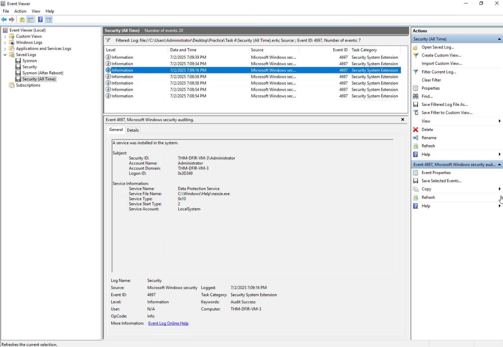
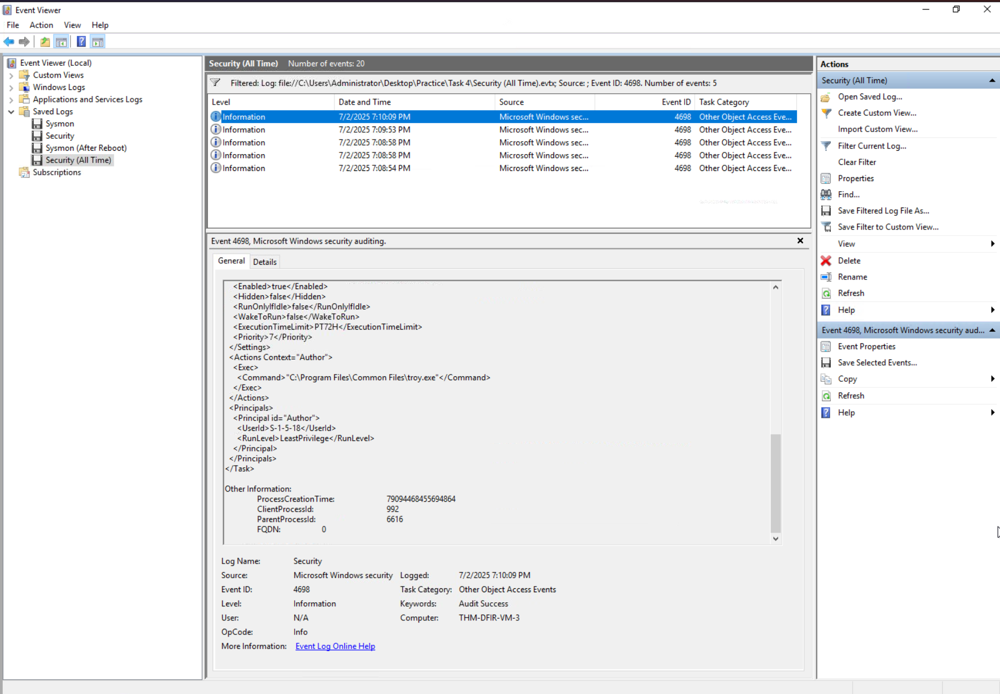

# Windows Threat Detection — Security Event and Sysmon Investigations

## Executive Summary

This case study brings together **nine independent simulated Windows investigations** across initial access, discovery, collection, external communication, and persistence. Using Windows Security events and Sysmon telemetry, I correlated authentication records, process ancestry, command lines, DNS queries, file creation, and persistence configurations to assess suspicious behavior.

Highlights include **1,567 failed logons** (1,018 targeting `ADMINISTRATOR`), executable-to-DNS correlation, removable-media propagation, discovery commands spawned by a disguised executable, clipboard collection, PowerShell payload execution, and account- and configuration-based persistence.

These are **separate scenarios**, not a single intrusion timeline. Each finding distinguishes an observed command or event from a confirmed outcome; DNS resolution, for example, does not by itself establish C2 communication or exfiltration.

## Scope and Method

| Area | Scenarios | Principal evidence |
| --- | --- | --- |
| Initial access | 1–3: RDP, phishing-associated execution, removable media | Security `4625` / `4624`; Sysmon `1`, `11`, `22` |
| Discovery and collection | 4–5: invoice executable, suspected information collection | Sysmon process trees, command lines, DNS events |
| External communication and persistence | 6–9: payload delivery, accounts, services, scheduled tasks | Sysmon `1`, `15`, `22`; Security `4720` / `4732`; configuration evidence |

**Workflow:** Identify a suspicious event; pivot on the host, process, account, and timeframe; correlate supporting records; evaluate what the events actually establish; and propose defensive detection logic. Process IDs should be correlated with host and time because they can be reused.

The 21 figures are selected screenshots from the simulated investigations. All detection rules below are **proposals**, not implementations validated in a live SIEM.

## Initial Access Detection

### Scenario 1 — Suspicious RDP Authentication

Windows Security logs contained **1,567 Event ID `4625` failed logons**, including **1,018 against `ADMINISTRATOR`**. This concentration suggested password-guessing activity but did not identify a single attacker or establish that all failures came from the same source.


*Figure 1 — Aggregation of failed logon events, including attempts against administrative and common account names.*

A separate Security Event ID `4624` recorded a successful **RemoteInteractive (Logon Type 10)** session for `Administrator` from `203.205.34.107`.


*Figure 2 — Successful Administrator RemoteInteractive logon associated with source `203.205.34.107`.*

**Assessment:** High-volume failures and a successful RDP logon warranted investigation for possible credential compromise. The available records do **not** prove that the successful session belonged to the actor behind the failed attempts. Correlation should compare timestamps, usernames, source addresses, and target hosts.

### Scenario 2 — Phishing-Associated Executable and DNS Activity

Sysmon Event ID `1` recorded execution of `C:\Users\Administrator\Pictures\best-cat.jpg.exe` (PID `5484`). Its double extension made the executable appear image-like in the simulated phishing scenario.


*Figure 3 — Process creation for `best-cat.jpg.exe`, PID `5484`.*

Sysmon Event ID `22` showed the same executable/PID querying `rj.store`. The DNS query returned **status `9003` (name error)**.


*Figure 4 — DNS request for `rj.store` associated with PID `5484`; resolution failed.*

**Assessment:** Matching process context connected suspicious execution with attempted external name resolution. The DNS error did not establish a successful network connection or command-and-control exchange. Detection should correlate untrusted executable paths, suspicious naming, and process-linked DNS activity.

### Scenario 3 — Removable-Media Execution and Propagation

Sysmon Event ID `1` recorded execution of `E:\Open Sandisk 4GB USB.exe` from a simulated removable drive.


*Figure 5 — Executable launched from removable drive `E:`.*

Sysmon Event ID `11` then recorded that source process creating `C:\Users\Public\Documents\winupdate.exe`.


*Figure 6 — File creation for `winupdate.exe` under the Public Documents directory.*

The same originating process created `F:\Open Data Traveler 32 GB USB.exe` on another simulated removable drive.


*Figure 7 — Creation of a drive-themed executable on the second removable drive, `F:`.*

**Assessment:** Execution from one removable drive followed by creation of a local executable and a similarly named file on another drive was consistent with **removable-media propagation**. The evidence did not show subsequent execution of either newly created file or compromise of another endpoint.

## Discovery and Collection

### Scenario 4 — Disguised Invoice and System Discovery

Sysmon Event ID `1` showed `explorer.exe` launching `invoice.pdf.exe` (PID `1492`). The document-like double extension and subsequent child processes made this a strong starting point for process-tree analysis.


*Figure 8 — Execution of `invoice.pdf.exe`, PID `1492`, from Windows Explorer.*

The executable spawned `whoami.exe` (PID `6104`), identifying the current user context.


*Figure 9 — `whoami.exe` launched as a child of `invoice.pdf.exe`.*

Another child command inspected the process list for CrowdStrike Falcon:

```cmd
cmd /c "tasklist /v | findstr csfalconservice.exe || echo No CrowdStrike EDR"
```


*Figure 10 — Process evidence for a security-tool discovery command spawned by the suspicious executable.*

Sysmon Event ID `22` also recorded a query for `exfil.beecz.cafe` associated with `invoice.pdf.exe`. QueryStatus `9003` indicated unsuccessful resolution.


*Figure 11 — DNS name error for `exfil.beecz.cafe` in the suspicious process context.*

**Assessment:** The parent-child relationships established user discovery and an attempt to identify security tooling. The process and DNS events did not show whether CrowdStrike was installed, whether the query resolved, or whether data was transmitted.

### Scenario 5 — Suspected Information Collection

Process evidence showed `stealer.exe` launching a command to prepare a temporary directory:

```cmd
cmd /c "mkdir %TEMP%\staging_58f1"
```


*Figure 12 — Staging-directory creation command launched from the suspicious executable context.*

A subsequent PowerShell command attempted to copy clipboard content to a file:

```powershell
powershell -c "Get-Clipboard > $env:Temp\staging_58f1\clipboard.txt"
```


*Figure 13 — PowerShell clipboard-collection command associated with `stealer.exe`.*

Sysmon Event ID `22` recorded a DNS query for `collecteddata-storage-2025.s3.amazonaws.com`; the captured response supported hostname resolution.


*Figure 14 — DNS event for an external Amazon S3-style storage hostname.*

**Assessment:** The commands indicated attempted local staging and clipboard collection; the DNS activity suggested a possible external destination. The evidence did not independently verify clipboard contents, completion of file writes, an S3 upload, or successful exfiltration.

## External Communication and Persistence

### Scenario 6 — PowerShell Payload Delivery and DNS Activity

Sysmon Event ID `15` showed a `Zone.Identifier` alternate data stream for `URGENT!.zip`, providing externally sourced archive context. That metadata did not establish archive-content execution.


*Figure 15 — `Zone.Identifier` metadata associated with `URGENT!.zip`.*

A PowerShell command retrieved `update.exe` from `http://10.14.97.15/update.exe`, saved it beneath the Administrator's AppData Roaming directory, and launched it. Sysmon Event ID `1` recorded the child executable:

| Field | Observed value |
| --- | --- |
| Image | `C:\Users\Administrator\AppData\Roaming\update.exe` |
| Process ID | `4340` |
| Parent | `powershell.exe` (PID `3140`) |
| Integrity level | High |


*Figure 16 — `update.exe` execution with PowerShell as its parent process.*

Sysmon Event ID `22` linked PID `4340` to `route.m365officesync.workers.dev`, but returned QueryStatus `9003` with no successful resolution.


*Figure 17 — Unsuccessful DNS query associated with `update.exe`, PID `4340`.*

**Assessment:** The process chain supported payload retrieval and execution, followed by attempted name resolution. `10.14.97.15` was the **download source**, not an independently verified C2 server. No successful C2 session or command exchange was demonstrated.

### Scenario 7 — Local Account and Privileged Membership

Windows Security Event ID `4720` recorded creation of a new account during the simulated persistence scenario.


*Figure 18 — Windows Security Event ID `4720` confirming account creation.*

Security Event ID `4732` recorded addition of a member to a security-enabled local group, investigated here in the context of local Administrators membership.


*Figure 19 — Windows Security Event ID `4732` documenting privileged-group membership modification.*

**Assessment:** These account-management events provided stronger evidence of actual configuration changes than process commands alone. They did not prove a later successful login using the new account. A useful detection correlates newly created account identifiers with subsequent additions to the built-in Administrators group.

### Scenario 8 — Windows Service Persistence

The preserved service-configuration evidence identified an automatically starting Windows service associated with an executable. Automatic service startup can enable execution after a restart.



*Figure 20 — Service configuration showing an automatic startup setting and executable association.*

**Assessment:** Suspicious service configuration was consistent with a persistence mechanism. Execution after a reboot was not independently demonstrated. Detection should evaluate service-installation telemetry (for example, System Event ID `7045` where collected), startup configuration, executable location, and change authorization.

### Scenario 9 — Scheduled Task Persistence

The final scenario identified a scheduled task configured with a **boot trigger**, providing a potential mechanism for execution when Windows starts.



*Figure 21 — Scheduled task configuration with a boot-triggered action.*

**Assessment:** The configuration supported suspected scheduled-task persistence, but did not independently show execution at the next boot. Monitoring should include Security Event ID `4698` (when enabled), Task Scheduler Operational logs, task definitions, and action paths.

## Detection Opportunities

The most useful opportunities are behavioral correlations rather than standalone filename or domain matches.

| Use case | Proposed detection | Telemetry |
| --- | --- | --- |
| Authentication attack | Cluster `4625` failures by user, source, and host; examine subsequent `4624` Type 10 sessions | Windows Security `4625`, `4624` |
| Disguised executable | Investigate double-extension executables and unusual process ancestry | Sysmon `1` |
| Process-to-DNS pivot | Match executable path, process context, host, and timeframe to unexpected queries | Sysmon `1`, `22` |
| Removable-media propagation | Correlate executable launch from removable media with creation of additional executables | Sysmon `1`, `11` |
| Security-tool discovery | Detect suspicious parents launching `tasklist`, `whoami`, or analogous discovery tools | Sysmon `1` |
| Collection and staging | Correlate temporary staging directories with PowerShell clipboard access | Process telemetry, PowerShell logging |
| Potential exfiltration | Investigate suspicious collection activity followed by connections or DNS queries to external storage | DNS, proxy, network flow, file telemetry |
| Privileged account persistence | Match `4720` account creation to subsequent `4732` Administrators membership | Windows Security `4720`, `4732` |
| Service persistence | Investigate unexpected autostart services and anomalous image paths | System `7045`, service configuration |
| Scheduled task persistence | Alert on unexpected boot-triggered tasks, especially with suspicious actions | Security `4698`, Task Scheduler Operational |

**Priority correlations:** (1) repeated failures followed by successful RDP authentication with corroborating source/account context; (2) suspicious process trees leading to discovery commands and unusual DNS; and (3) a newly created account added to local Administrators. These are proposed detection designs; no SIEM rules were deployed or performance-tested for this case study.

## MITRE ATT&CK Mapping

The following techniques contextualize behavior from **separate simulated cases**. Where only an attempted action was observed, the mapping reflects that limit.

| Scenario | Technique | ID | Evidence basis |
| --- | --- | --- | --- |
| RDP | Brute Force | `T1110` | High-volume failed authentication attempts; success not attributed to the same actor |
| Phishing-associated executable | User Execution: Malicious File | `T1204.002` | Execution of `best-cat.jpg.exe` in the simulated phishing context |
| Removable media | Replication Through Removable Media | `T1091` | Executable created on a second removable drive |
| Invoice executable | System Owner/User Discovery | `T1033` | `whoami.exe` launched from suspicious process tree |
| Invoice executable | Software Discovery: Security Software Discovery | `T1518.001` | Search for the CrowdStrike process |
| Collection | Data Staged | `T1074` | Staging-directory preparation observed; staged data contents not confirmed |
| Collection | Clipboard Data | `T1115` | `Get-Clipboard` command executed; resulting contents not preserved |
| Payload delivery | Ingress Tool Transfer | `T1105` | PowerShell retrieval of `update.exe` |
| Account persistence | Create Account: Local Account | `T1136.001` | Account-creation event `4720` |
| Privileged membership | Account Manipulation: Additional Local or Domain Groups | `T1098.007` | Local group membership event `4732` |
| Service persistence | Create or Modify System Process: Windows Service | `T1543.003` | Automatically starting service configuration |
| Scheduled task | Scheduled Task/Job: Scheduled Task | `T1053.005` | Boot-triggered task configuration |

A successful RDP logon alone was **not** mapped to a definitive external-remote-services intrusion because the relationship to the failed attempts was not established. Similarly, DNS queries returning `9003` were not mapped as confirmed command-and-control sessions.

## Evidence Limitations

| Scenario | What the evidence establishes | What remains unverified |
| --- | --- | --- |
| 1 — RDP | Failed logon volume and a successful RemoteInteractive session | Common actor behind failed and successful logons |
| 2 — Phishing | Executable process and failed DNS lookup | Successful C2 connectivity or later payload behavior |
| 3 — USB | Initial execution and creation of two further executables | Execution of newly created files or infection of another host |
| 4 — Discovery | Suspicious parent-child execution and DNS name error | Security-product presence, data theft, or later movement |
| 5 — Collection | Staging and clipboard-related commands; external storage DNS | Contents captured, completed file writes, or S3 upload |
| 6 — Payload | Download-related execution and unsuccessful DNS query | Successful external C2 session |
| 7 — Accounts | Recorded account creation and local-group membership changes | Later authentication with the new account |
| 8 — Service | Suspicious automatic startup configuration | Post-reboot payload execution |
| 9 — Task | Boot-triggered scheduled-task configuration | Post-reboot action execution |

The screenshots represent selected telemetry, not a full host forensic image or packet capture. A process event shows execution of a command, but not necessarily success of every operation it requested; a DNS query does not establish application-layer communication; and file creation does not prove later execution.

## Skills Demonstrated

- **Windows monitoring:** Security logon and account events; Sysmon process, file, and DNS analysis
- **Endpoint investigation:** Process ancestry, suspicious executables, removable-media activity, command-line analysis
- **Collection assessment:** Clipboard-access commands, staging indicators, process-to-network pivots
- **Persistence analysis:** Local privileged accounts, autostart services, boot-triggered tasks
- **SOC reporting:** Correlation logic, MITRE ATT&CK mapping, evidence limitations, detection recommendations

**Key takeaway:** Across nine independent scenarios, correlating process context, Windows events, and configuration changes produced more defensible assessments than isolated alert names or individual indicators.
