# Windows Threat Detection — Security Event and Sysmon Investigations

## Executive Summary

This project documents nine simulated Windows security investigations focused on detecting and analyzing suspicious activity using Windows Security event logs, Sysmon telemetry, and endpoint process evidence.

The investigations covered initial access, post-compromise discovery, data collection, command-and-control activity, and persistence.

Rather than relying exclusively on individual event IDs or detection alerts, I examined process relationships, command-line arguments, authentication activity, file operations, DNS queries, and Windows configuration changes to understand the behavior represented by each scenario.

The analysis included:

- **Initial access:** RDP authentication attacks, phishing-related executable delivery, and malware execution originating from removable media.
- **Discovery and collection:** Suspicious process trees, system and security-software discovery, clipboard collection, and potential data staging.
- **Command and control:** PowerShell-based payload retrieval, executable launch, and suspicious external communication.
- **Persistence:** Unauthorized local account creation, privileged-group membership changes, Windows service installation, and scheduled-task configuration.

The objective was to identify meaningful security events, correlate related evidence, distinguish attacker intent from confirmed outcomes, and translate the findings into actionable detection opportunities.

These investigations represent separate simulated scenarios grouped into a single defensive security case study. They do not describe one continuous intrusion.

## Investigation Scope

The investigation focused on three categories of Windows security monitoring.

| Category | Scenarios | Primary Focus |
| --- | --- | --- |
| Initial Access | RDP authentication, phishing-related execution, removable-media infection | Detecting suspicious access and initial malware execution |
| Discovery and Collection | Suspicious process ancestry, endpoint discovery, clipboard access, potential file staging | Identifying post-compromise information gathering and collection |
| Command and Control / Persistence | Payload delivery, backdoor accounts, Windows services, scheduled tasks | Investigating attacker communications and durable access mechanisms |

### Investigation Objectives

The analysis sought to answer several recurring questions:

1. What Windows events or process behaviors indicated suspicious activity?
2. Which event fields helped establish the affected user, process, host, or resource?
3. Could process ancestry, timestamps, and related artifacts connect multiple events?
4. Which activities represented confirmed outcomes, and which were only attempted?
5. What additional telemetry would strengthen the investigative conclusions?
6. How could the findings be converted into useful SOC detection logic?

## Evidence Sources and Analysis Methodology

### Evidence Sources

The investigations used Windows endpoint telemetry, including:

- **Windows Security events:** Authentication activity, account creation, and privileged-group membership changes.
- **Sysmon process events:** Process creation, parent-child relationships, and command-line arguments.
- **Sysmon DNS events:** Queries associated with suspicious executable activity.
- **File and configuration artifacts:** Executable paths, staging locations, service configuration, and scheduled-task details.

The specific events and fields varied by scenario. Each finding was evaluated using the evidence available for that investigation.

### Analysis Approach

The investigations followed a consistent process:

| Step | Analyst Activity |
| --- | --- |
| 1. Identify | Locate suspicious events, processes, authentication patterns, or configuration changes |
| 2. Pivot | Examine event IDs, users, process IDs, command lines, and related activity |
| 3. Correlate | Connect events through process ancestry, host context, timestamps, or affected resources |
| 4. Assess | Determine what the evidence establishes and identify plausible attacker objectives |
| 5. Document | Preserve relevant screenshots, indicators, and investigative conclusions |
| 6. Recommend | Identify detection opportunities and additional telemetry that could improve visibility |

### Evidence Standards

The analysis distinguishes between **observed commands**, **confirmed system events**, and **inferred attacker objectives**.

For example, a DNS query does not independently prove successful command-and-control communication or data transfer. Similarly, a process-creation event may show an attempted configuration change without establishing that the requested change succeeded.

Windows Security events confirming account creation or privileged-group membership provide stronger evidence of those specific outcomes.

Where screenshots or logs did not establish the result of an action, the investigation documents the activity without assuming success.

## Investigation Organization

The report is organized by threat behavior rather than by the order in which the training scenarios were completed.

The following sections examine:

1. Initial access through RDP, phishing-related execution, and removable media.
2. Discovery and collection through suspicious Windows process activity.
3. Command-and-control behavior involving PowerShell and external infrastructure.
4. Persistence through local accounts, services, and scheduled tasks.

Each scenario is evaluated independently, with cross-scenario observations reserved for the final detection and defensive-analysis sections.

## Initial Access Detection

### Scenario 1 — Suspicious RDP Authentication

#### Investigation Context

The first scenario involved Windows Remote Desktop Protocol (RDP) authentication activity consistent with a password-guessing attack.

Windows Security logs contained **1,567 failed logon events**, including **1,018 targeting the `ADMINISTRATOR` account**.

The concentration of authentication failures against a privileged account was a significant indicator of potentially automated password guessing.

The investigation focused on identifying the authentication pattern, determining whether any attempts succeeded, and assessing the implications of subsequent remote access.

#### Failed Authentication Analysis

Windows Security Event ID `4625` records a failed logon attempt.

The investigation examined repeated failures and the accounts targeted to understand whether the activity resembled ordinary user error or a coordinated attempt to obtain access.

| Observation | Investigative Significance |
| --- | --- |
| 1,567 failed logon events | High volume of unsuccessful authentication activity |
| 1,018 failures targeting `ADMINISTRATOR` | Concentration of activity against a privileged account |
| Repeated authentication attempts | Pattern consistent with password guessing or brute-force activity |

*Figure 1 — PowerShell aggregation of Windows Security Event ID 4625, showing repeated failed logons targeting administrative and common usernames.*

The number of failed logons alone did not establish the attacker's identity or prove that all attempts originated from one source.

Source addresses, timestamps, logon types, and account names would be useful fields for validating the pattern and distinguishing brute-force attempts from password spraying or other authentication failures.

#### Successful RDP Authentication

Additional Windows Security telemetry identified Event ID `4624`, which records a successful logon.

The observed event included **Logon Type `10`**, indicating a RemoteInteractive logon associated with Remote Desktop Services.

*Figure 2 — Windows Security Event ID 4624 confirming an Administrator RemoteInteractive logon from 203.205.34.107.*

This was an important finding because the investigation contained both unsuccessful authentication attempts and evidence of a successful remote logon.

A successful RDP logon following repeated failures warrants investigation for potential account compromise.

However, a successful logon event does not independently prove that the same actor responsible for the failed attempts obtained access. That relationship requires correlation of account details, source addresses, timestamps, and session context.

#### Analyst Assessment

The combination of high-volume authentication failures, targeting of a privileged account, and successful RDP authentication was consistent with a potential credential-based initial-access incident.

**Assessment:** Suspicious RDP authentication activity requiring investigation for possible unauthorized access.

The evidence supported repeated failed logons and a successful remote-interactive session. Attribution of the successful session to the preceding password-guessing activity would require additional correlation.

#### Detection Opportunities

A useful SOC detection strategy would include:

- Threshold-based alerting on repeated Event ID `4625` failures within a defined period.
- Separate monitoring for high-volume authentication failures targeting privileged accounts.
- Correlation of multiple failed logons followed by Event ID `4624` with Logon Type `10`.
- Comparison of source addresses, account names, and host context to determine whether authentication attempts were related.
- Investigation of unexpected RDP access from unfamiliar sources or outside approved access windows.

These detections should account for legitimate administrative activity and authentication misconfigurations to minimize false positives.

### Scenario 2 — Phishing-Related Executable Execution

#### Investigation Context

The second scenario involved suspicious executable activity associated with a phishing-related initial-access attempt.

The investigation used Windows endpoint telemetry to examine how the executable was launched and whether subsequent behavior suggested malicious activity.

The focus was on correlating process execution with network indicators rather than treating the executable's presence as proof of compromise.

#### Suspicious Process Execution

Sysmon process telemetry identified executable activity associated with the suspected phishing scenario.

The investigation examined the executable's path, process context, and available command-line information to determine whether the behavior was consistent with legitimate user activity.

Process-creation evidence was particularly useful because it helped establish that the suspicious file was executed, rather than merely downloaded or stored.

The process evidence also provided a starting point for investigating subsequent network activity.

*Figure 3 — Sysmon Event ID 1 showing execution of `C:\Users\Administrator\Pictures\best-cat.jpg.exe` (PID 5484), a double-extension executable associated with the simulated phishing scenario.*

#### DNS Activity

Additional Sysmon telemetry recorded DNS-related activity associated with the suspicious executable.

Correlating the executable with its DNS queries helped establish the relationship between local process execution and attempted external communication.

A DNS query alone does not prove that a remote connection was successfully established or that command-and-control traffic was exchanged.

However, unexpected DNS activity originating from a suspicious executable provides an important indicator for further investigation.

*Figure 4 — Sysmon Event ID 22 recording a DNS query for `rj.store` from `best-cat.jpg.exe` (PID 5484). QueryStatus 9003 indicates the name was not resolved.*

#### Analyst Assessment

The combination of suspicious executable activity and associated DNS queries was consistent with possible malware execution following a phishing-related initial-access attempt.

**Assessment:** Suspicious execution and external communication requiring investigation.

The evidence supported the presence of process and DNS activity, but did not independently establish successful command-and-control communication or the full impact of the executable.

#### Detection Opportunities

- Alert on suspicious executables launched from user-writable locations.
- Correlate unusual process execution with subsequent DNS activity.
- Investigate unexpected executables associated with phishing-related alerts.
- Review parent-child process relationships and execution paths.
- Prioritize processes contacting unusual external domains shortly after execution.

### Scenario 3 — Removable-Media Infection and Propagation

#### Investigation Context

The third scenario involved suspicious executable activity originating from a removable USB drive, followed by the creation of additional executable files on the compromised Windows endpoint and another removable drive.

The investigation used Sysmon process-creation and file-creation events to determine how the suspicious executable operated and whether the activity was consistent with malware propagation.

#### Initial Execution from Removable Media

Sysmon Event ID `1` identified the execution of an executable named:

`E:\Open Sandisk 4GB USB.exe`

The executable ran from the `E:` drive, which represented the removable-media location in the simulated scenario.

Its filename resembled a utility for opening the USB drive, potentially encouraging a user to execute it while accessing removable storage.

The process-creation event established that the executable ran, rather than merely existing on the USB drive.

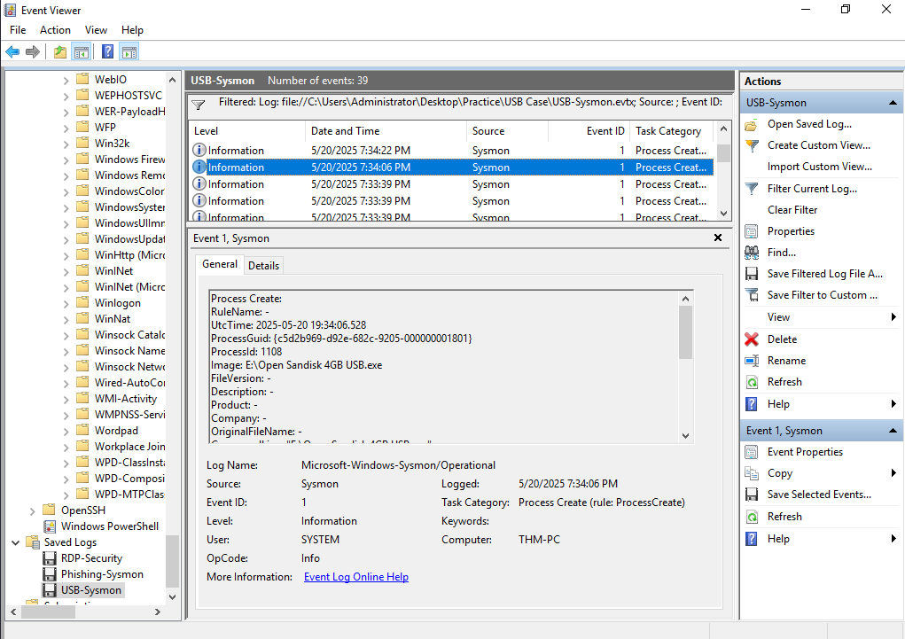

*Figure 5 — Sysmon Event ID 1 showing execution of `Open Sandisk 4GB USB.exe` from the removable `E:` drive.*

#### Local Payload Creation

Subsequent Sysmon Event ID `11` telemetry recorded the USB-hosted executable creating another file:

`C:\Users\Public\Documents\winupdate.exe`

The source process was the same suspicious USB executable identified in the earlier process-creation event.

This connected removable-media execution to the creation of a second executable in a local Windows directory.

The filename `winupdate.exe` resembled Windows update-related software, although the preserved evidence did not establish that the executable was a legitimate Windows component.

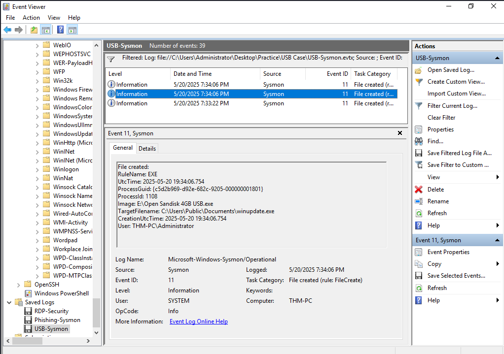

*Figure 6 — Sysmon Event ID 11 recording the USB executable creating `winupdate.exe` in `C:\Users\Public\Documents`.*

The file-creation event confirmed that the executable was written to disk. It did not independently establish that `winupdate.exe` subsequently executed.

#### Propagation to Another USB Drive

Another Sysmon Event ID `11` recorded the original USB executable creating a file on a second removable drive:

`F:\Open Data Traveler 32 GB USB.exe`

The filename again resembled a removable-drive access utility.

This behavior was consistent with a malware propagation attempt: an executable originating from one USB drive created a similarly named executable on another removable drive.

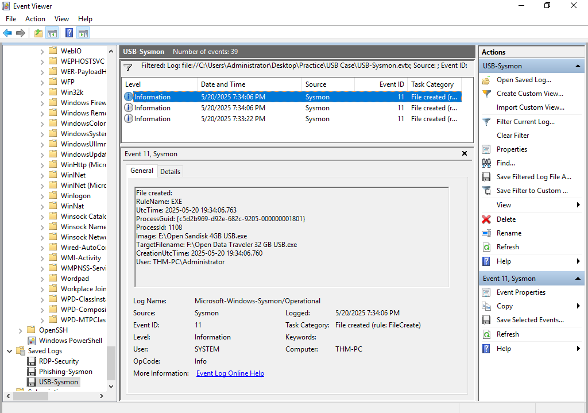

*Figure 7 — Sysmon Event ID 11 showing `Open Sandisk 4GB USB.exe` creating `Open Data Traveler 32 GB USB.exe` on the `F:` drive.*

The evidence established file creation on the second drive, but did not prove that the new executable was later launched or infected another endpoint.

#### Analyst Assessment

The investigation identified three connected observations:

1. A suspicious executable launched from removable media.
2. That executable created a local executable named `winupdate.exe`.
3. The same source process created another drive-themed executable on a second removable drive.

The combination of execution from removable media, local payload creation, and replication onto another drive was consistent with malware propagation.

**Assessment:** Suspicious removable-media execution and probable propagation activity.

The preserved evidence confirmed the initial process execution and subsequent file creation. It did not independently establish execution of the newly created files.

#### Detection Opportunities

- Detect unexpected executable launches from removable drive letters.
- Monitor removable-media processes creating executables in local Windows directories.
- Correlate executable creation on a second removable drive with preceding execution from another drive.
- Investigate files impersonating removable-drive utilities or operating-system update components.
- Use Sysmon Event IDs `1` and `11` to connect originating processes with newly created executable files.

## Discovery and Collection

### Scenario 4 — Suspicious Process Ancestry and System Discovery

#### Investigation Context

This scenario investigated suspicious Windows process activity associated with an executable named `invoice.pdf.exe`.

The filename used a double extension to resemble a PDF document while remaining a Windows executable.

The investigation focused on identifying the processes launched by the executable and determining whether their behavior was consistent with post-compromise reconnaissance.

#### Process Ancestry

Sysmon process-creation telemetry provided visibility into the suspicious executable and its child processes.

Instead of treating individual commands as unrelated events, the investigation examined their relationship to the originating executable.

The process ancestry was important because legitimate Windows discovery commands can become suspicious when launched by an unexpected executable masquerading as a document.

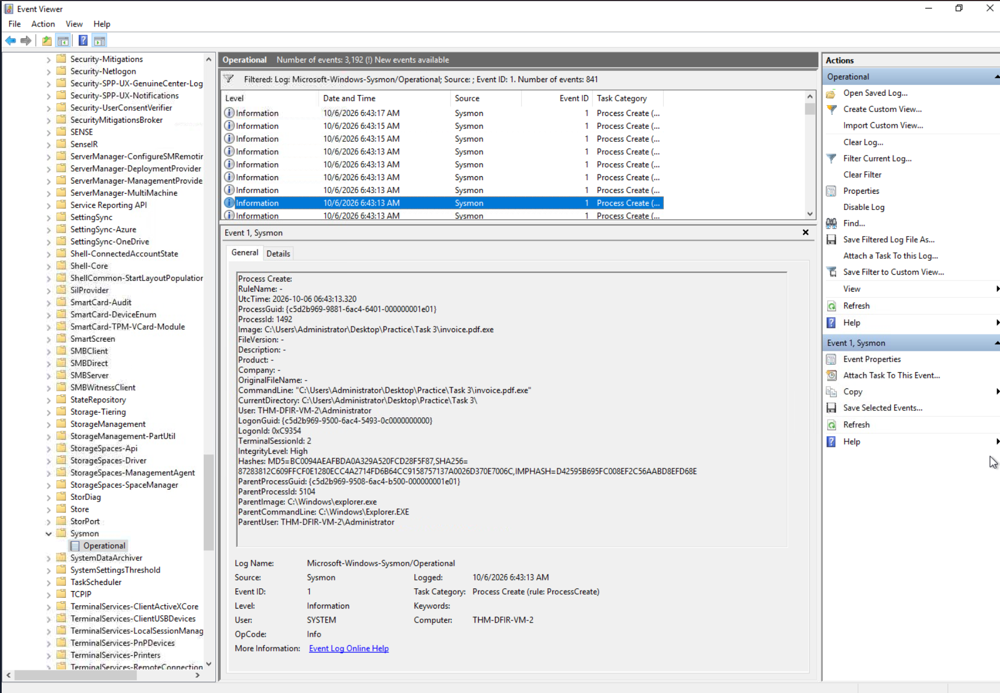

*Figure 8 — Sysmon Event ID 1 showing `invoice.pdf.exe` (PID 1492) launched from Windows Explorer.*

#### System Discovery

The observed child-process activity included commands used to gather information about the Windows environment.

The investigation examined the commands in the context of their parent process to assess whether the behavior was consistent with normal administration or attacker reconnaissance.

These observations supported an assessment of suspicious system discovery following execution of the apparent invoice attachment.

The process tree revealed that `invoice.pdf.exe` launched `whoami.exe` to identify the current user context.

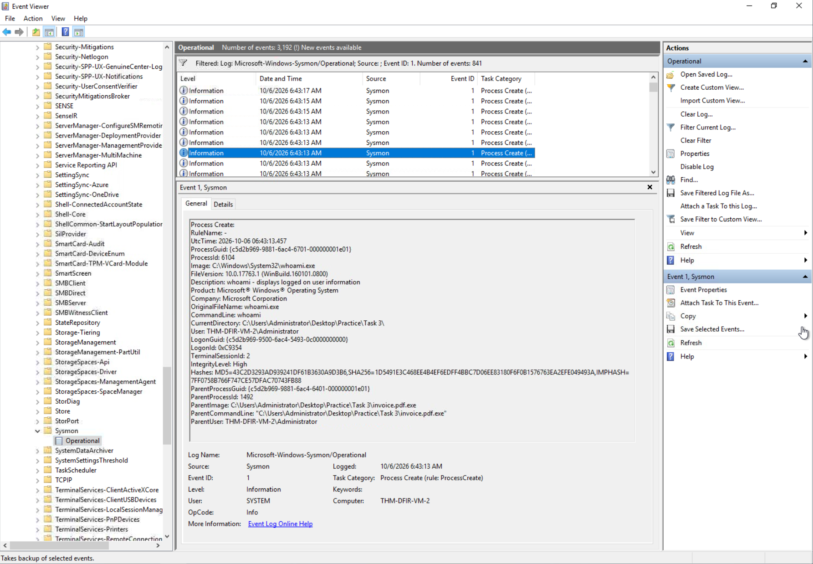

*Figure 9 — Sysmon Event ID 1 showing `whoami.exe` (PID 6104) with `invoice.pdf.exe` (PID 1492) as its parent process.*

Further process evidence identified a security-product discovery command:

`cmd /c "tasklist /v | findstr csfalconservice.exe || echo No CrowdStrike EDR"`

This command searched the running process list for the CrowdStrike Falcon sensor service process. Its execution demonstrated an attempt to identify installed endpoint security tooling.

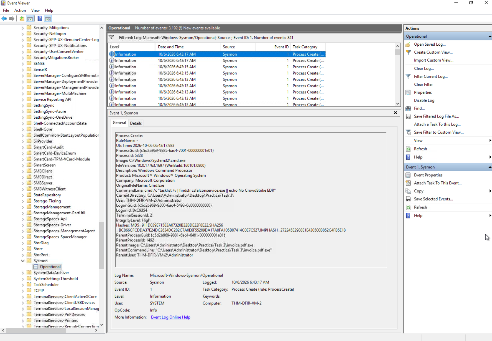

*Figure 10 — Sysmon Event ID 1 showing `cmd.exe` launched by `invoice.pdf.exe` to check for the CrowdStrike Falcon sensor process.*

#### Suspicious DNS Resolution

Sysmon Event ID 22 recorded a DNS query for `exfil.beecz.cafe`
associated with `invoice.pdf.exe`.

The event returned QueryStatus `9003`, indicating that the DNS
name could not be resolved.

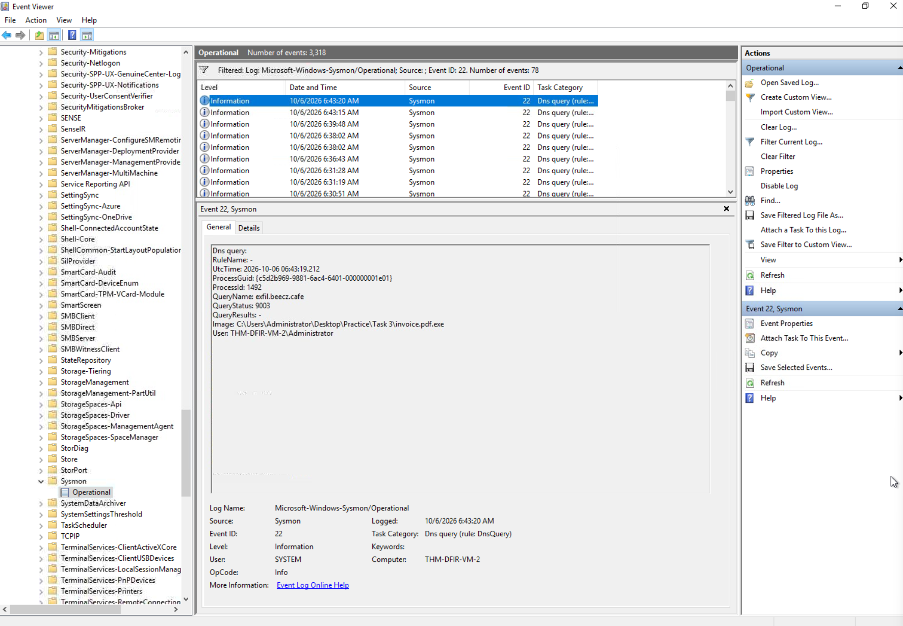

*Figure 11 — Sysmon Event ID 22 showing `invoice.pdf.exe`
querying `exfil.beecz.cafe`. QueryStatus 9003 indicates a
DNS name error.*

This connected attempted external communication to the
suspicious executable but did not establish successful
command-and-control communication or data exfiltration.

#### Analyst Assessment

The combination of a double-extension executable and related discovery commands was consistent with potentially malicious reconnaissance activity.

**Assessment:** Suspicious execution and post-compromise system discovery.

The process telemetry supported the execution relationship and discovery behavior, but did not independently establish subsequent lateral movement or privilege escalation.

#### Detection Opportunities

- Monitor executables using document-like double extensions, such as `.pdf.exe`.
- Detect unusual parent processes launching Windows discovery utilities.
- Correlate multiple discovery commands originating from a common process tree.
- Investigate suspicious executables launched from user-controlled locations.
- Use Sysmon process telemetry to distinguish command execution from assumed attacker outcomes.

### Scenario 5 — Automated Data Collection and Staging

#### Investigation Context

The fifth scenario involved a suspicious executable named `stealer.exe` performing activity consistent with automated information collection.

The investigation focused on identifying the executable's behavior through process-creation events, command-line evidence, and DNS telemetry.

The objective was to determine whether the observed activity indicated collection, staging, or potential exfiltration of information.

#### Collection and Staging Activity

The investigation identified suspicious process activity associated with `stealer.exe`.

Related command execution indicated attempts to collect information from the Windows environment and prepare it for potential transfer.

Process relationships were used to connect the observed commands to the originating executable rather than treating them as unrelated administrative activity.

The behavior was consistent with a potential data-collection workflow, although process execution alone did not establish the complete contents of collected information.

Process evidence showed `stealer.exe` launching a command
to create a staging directory:

`cmd /c "mkdir %TEMP%\staging_58f1"`

The directory was consistent with preparation for collecting
information before potential transfer.

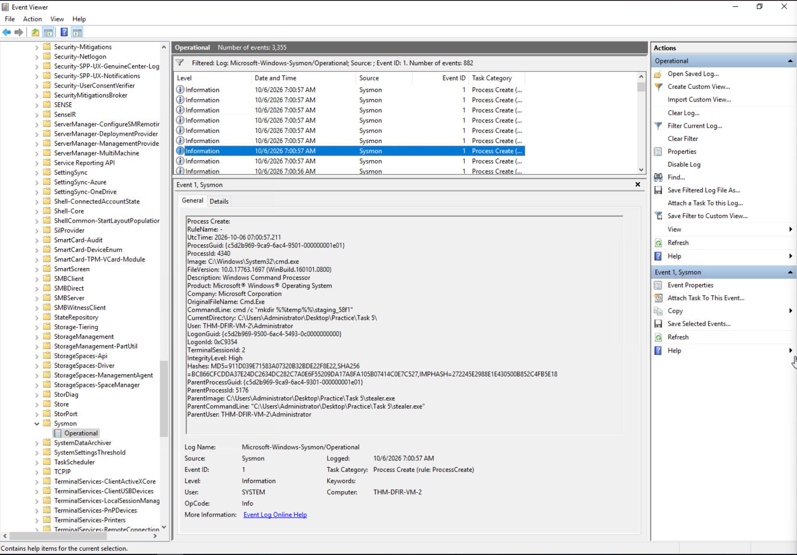

*Figure 12 — Sysmon Event ID 1 showing the suspicious
`stealer.exe` process launching `cmd.exe` to create a
temporary staging directory.*

#### Clipboard Collection

Additional process evidence identified PowerShell executing:

`Get-Clipboard`

This command retrieves the current contents of the Windows clipboard.

In the context of suspicious `stealer.exe` activity, clipboard access raised concern about collection of sensitive information, including potentially copied credentials or other confidential data.

However, the command's execution did not independently establish what information was present in the clipboard or whether the result was successfully transferred elsewhere.

The recorded PowerShell command redirected clipboard content
toward a file in the temporary staging directory:

`powershell -c "Get-Clipboard > $env:Temp\staging_58f1\clipboard.txt"`

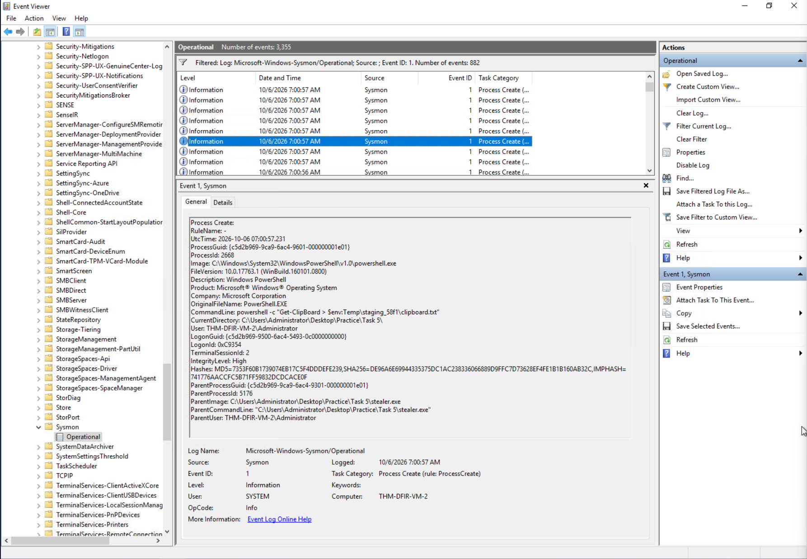

*Figure 13 — Sysmon Event ID 1 showing PowerShell clipboard
collection initiated from the `stealer.exe` process context.*

The process event confirmed execution of the collection
command, but did not independently reveal the clipboard
contents or verify the resulting file contents.

#### External Destination Investigation

Sysmon DNS telemetry identified a query involving:

`collecteddata-storage-2025.s3.amazonaws.com`

The destination resembled an Amazon S3 storage endpoint and was investigated as a possible location for collected information.

The DNS event established attempted name resolution associated with the observed activity. It did not prove that a network connection succeeded or that information was uploaded.

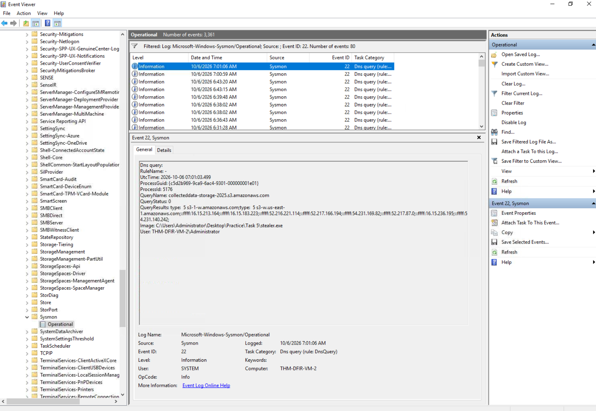

*Figure 14 — Sysmon Event ID 22 showing `stealer.exe`
resolving `collecteddata-storage-2025.s3.amazonaws.com`.*

The observed DNS response supported successful name
resolution of the external storage hostname. It did not
independently establish an HTTP connection, S3 upload,
or successful data exfiltration.

#### Analyst Assessment

The combination of a suspicious executable, data-collection commands, clipboard access, and DNS activity involving an external storage destination was consistent with possible information theft.

**Assessment:** Suspicious automated collection and staging with potential exfiltration intent.

The investigation supported identification of collection-related behaviors but did not independently confirm successful transfer of collected data to the external destination.

#### Detection Opportunities

- Correlate suspicious executables with the commands and processes they spawn.
- Monitor unexpected PowerShell clipboard access in suspicious execution contexts.
- Identify unusual collection or staging activity in user-writable directories.
- Correlate collection behavior with subsequent DNS queries for external storage services.
- Investigate potential data transfer using network telemetry rather than inferring an upload solely from DNS activity.

## Command and Control / Persistence

### Scenario 6 — PowerShell Payload Delivery and External Communication

#### Investigation Context

This scenario examined suspicious PowerShell activity involving the retrieval and execution of an external payload.

The investigation used Windows process and DNS telemetry to identify the download behavior, determine what executable was launched, and assess evidence of subsequent communication with external infrastructure.

#### Downloaded Archive Evidence

Sysmon Event ID `15` recorded an alternate data stream associated with the archive `URGENT!.zip`.

The `Zone.Identifier` metadata indicated that the archive originated from an external security zone, consistent with an Internet download.

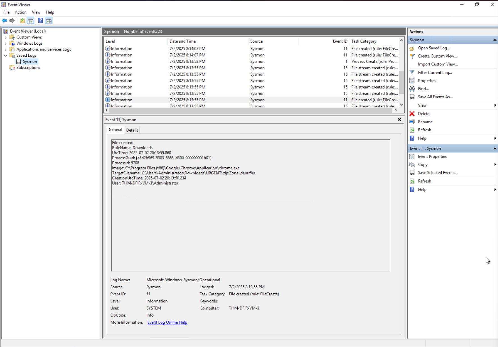

*Figure 15 — Sysmon Event ID 15 recording `Zone.Identifier` metadata associated with `URGENT!.zip`, providing context for the initial downloaded archive.*

The archive's origin provided useful context, but the file event alone did not establish that its contents executed.

#### Payload Retrieval and Execution

Process-creation telemetry identified PowerShell executing commands associated with downloading an executable named `update.exe`.

The recorded PowerShell parent command referenced the payload source:

`http://10.14.97.15/update.exe`

The command saved the executable to the user's AppData Roaming directory and launched it.

Sysmon Event ID `1` subsequently recorded:

| Field | Observed Value |
| --- | --- |
| Executable | `C:\Users\Administrator\AppData\Roaming\update.exe` |
| Process ID | `4340` |
| Parent process | `powershell.exe` |
| Parent PID | `3140` |
| Integrity level | High |

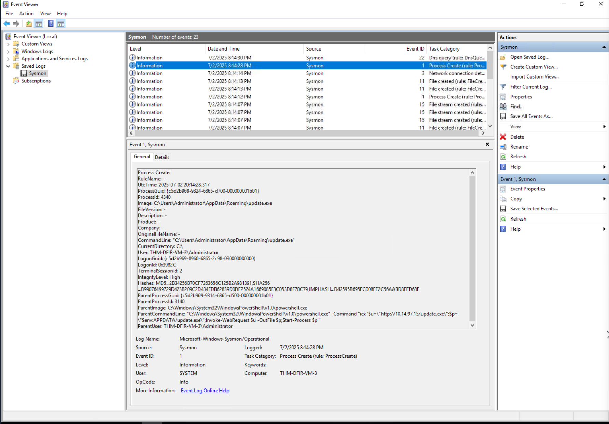

*Figure 16 — Sysmon Event ID 1 confirming execution of `update.exe` (PID 4340) with PowerShell as the parent process.*

The address `10.14.97.15` was the observed payload-download source. It was not automatically classified as the subsequent C2 destination.

The activity was suspicious because the command retrieved an executable from external infrastructure and subsequently launched it on the Windows endpoint.

Correlating the PowerShell command with later process activity helped distinguish the payload-delivery stage from subsequent execution.

The executable's name resembled legitimate software-update activity, but its filename alone did not establish that it was an authorized update.

#### External Communication

Additional Sysmon telemetry recorded DNS activity associated with the suspicious executable.

The DNS evidence was examined alongside the preceding PowerShell activity to determine whether the download-and-execution sequence was followed by attempted communication with external infrastructure.

A DNS query provides evidence of attempted name resolution, not necessarily a successful network connection or confirmed command-and-control session.

Sysmon Event ID `22` recorded a DNS query generated by the newly executed payload:

`route.m365officesync.workers.dev`

The event identified:

| Field | Observed Value |
| --- | --- |
| Process | `update.exe` |
| Process ID | `4340` |
| Query name | `route.m365officesync.workers.dev` |
| Query status | `9003` |
| Query results | None |

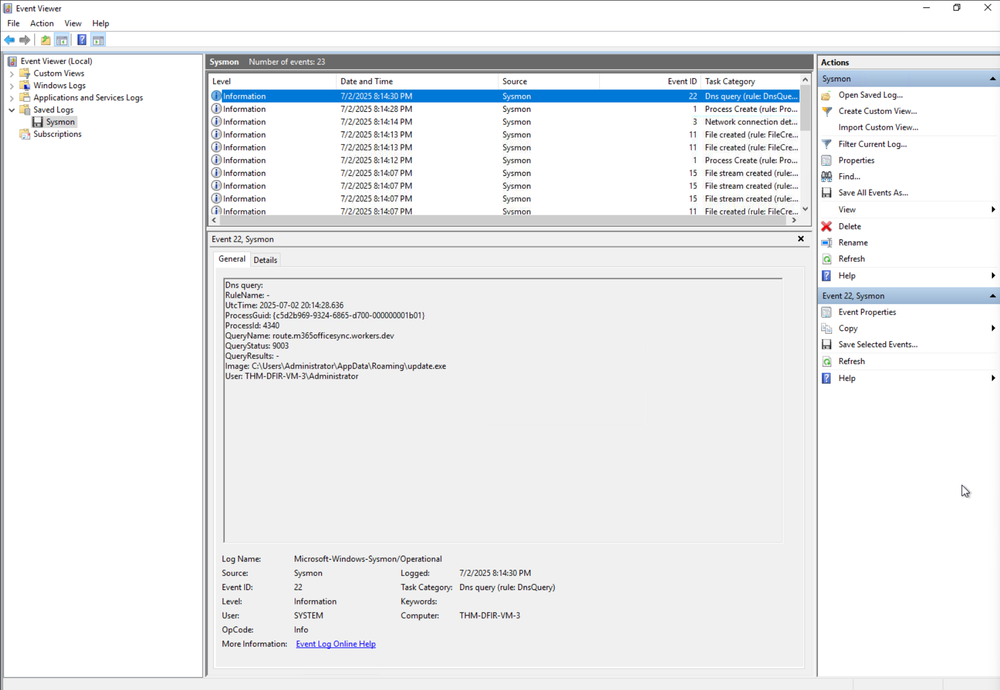

*Figure 17 — Sysmon Event ID 22 showing `update.exe` (PID 4340) attempting to resolve `route.m365officesync.workers.dev`.*

The matching PID linked the DNS activity to the previously observed payload process.

**QueryStatus `9003` indicates a DNS name error.** The event establishes attempted name resolution, not successful C2 connectivity or command exchange.

#### Analyst Assessment

The combination of PowerShell-based executable retrieval, subsequent payload execution, and associated DNS activity was consistent with suspicious payload deployment and possible command-and-control preparation.

**Assessment:** Suspicious external payload execution requiring investigation for potential C2 activity.

The preserved process and DNS evidence supported the observed execution sequence, but did not independently establish that commands were successfully exchanged with an external controller.

#### Detection Opportunities

- Detect PowerShell commands retrieving executable files from external destinations.
- Correlate downloads with subsequent process execution on the same endpoint.
- Investigate executables using update-related names outside approved software deployment workflows.
- Monitor DNS activity generated by newly downloaded or suspicious executables.
- Correlate process creation and DNS events using executable paths, process identifiers, and timestamps.

### Scenario 7 — Backdoor Account Creation and Privileged Group Membership

#### Investigation Context

This scenario investigated suspicious Windows account-management activity consistent with an attempt to establish persistent administrative access.

The investigation focused on identifying newly created accounts and determining whether those accounts received elevated privileges through membership in the local Administrators group.

Windows Security events were particularly valuable because they provided evidence of completed account-management operations.

#### Local Account Creation

Windows Security Event ID `4720` recorded the creation of a new user account.

In the context of a suspected compromise, unexpected local account creation can indicate an attempt to establish an alternative means of accessing the endpoint.

The event was examined to identify the newly created account and the security principal responsible for the operation.

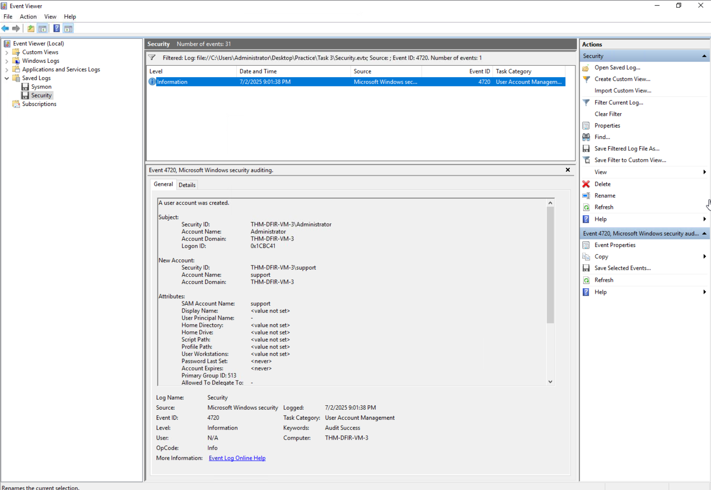

*Figure 18 — Windows Security Event ID 4720 confirming creation of a new user account during the simulated persistence scenario.*

Unlike process telemetry showing a `net user` command, Event ID `4720` provides direct evidence that Windows recorded the account-creation operation.

#### Privileged Group Membership

Additional Windows Security telemetry identified Event ID `4732`, indicating that a member was added to a security-enabled local group.

The event was examined to determine whether the newly created account received membership in the built-in Administrators group.

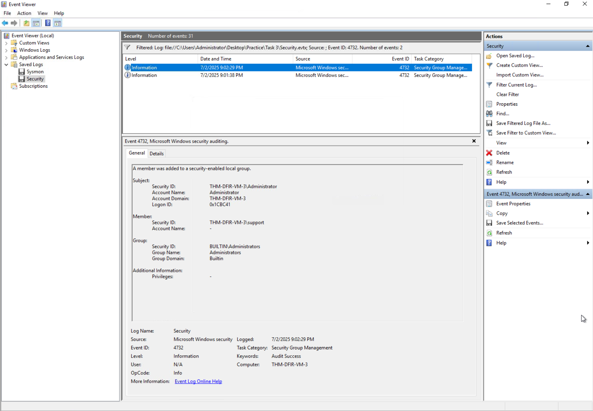

*Figure 19 — Windows Security Event ID 4732 recording addition of a member to a security-enabled local group during the simulated persistence scenario.*

Adding an attacker-controlled account to Administrators can provide a durable path to privileged access, assuming the account remains enabled and the attacker possesses usable credentials.

#### Analyst Assessment

The relationship between the account-creation event and the privileged-group membership event supported a persistence assessment.

**Assessment:** Suspicious account-based persistence through creation of an additional user account and modification of privileged group membership.

The preserved events confirmed account-management changes. They did not independently prove that the new account was subsequently used to authenticate or establish a remote session.

#### Detection Opportunities

- Monitor Event ID `4720` for unexpected local account creation.
- Correlate newly created accounts with Event ID `4732` changes to the Administrators group.
- Investigate account-management events occurring shortly after suspicious executable or PowerShell activity.
- Review the subject account responsible for changes and the affected account's intended purpose.
- Detect newly created privileged accounts outside approved provisioning workflows.