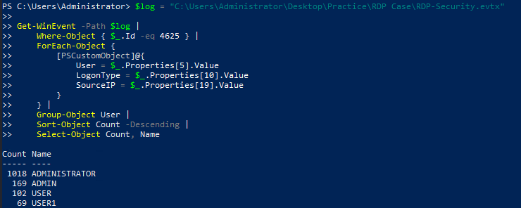
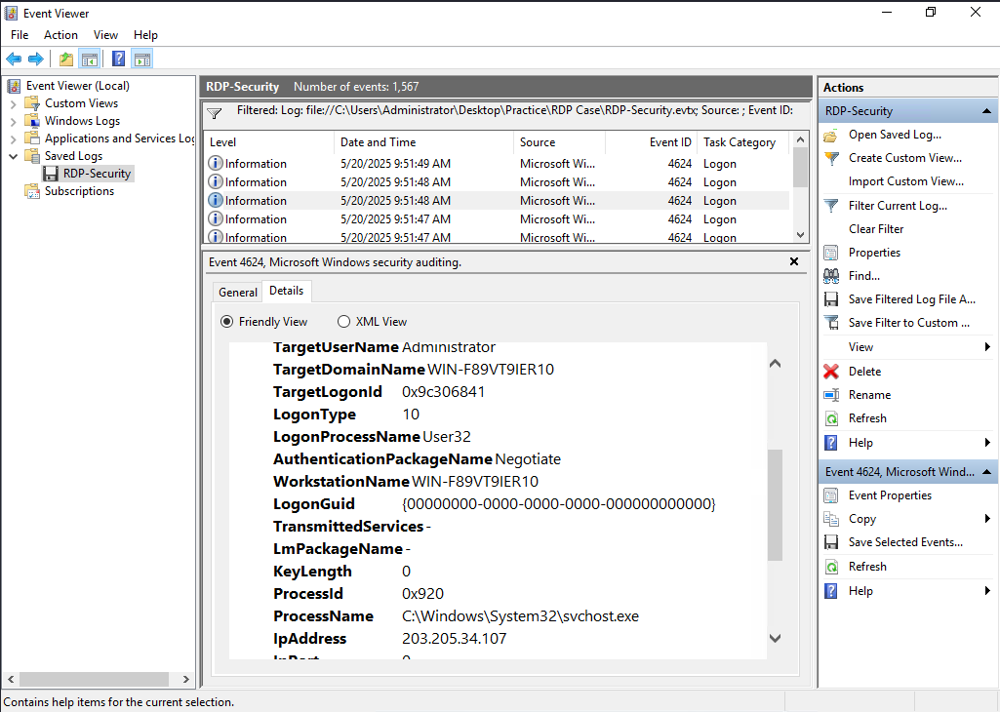
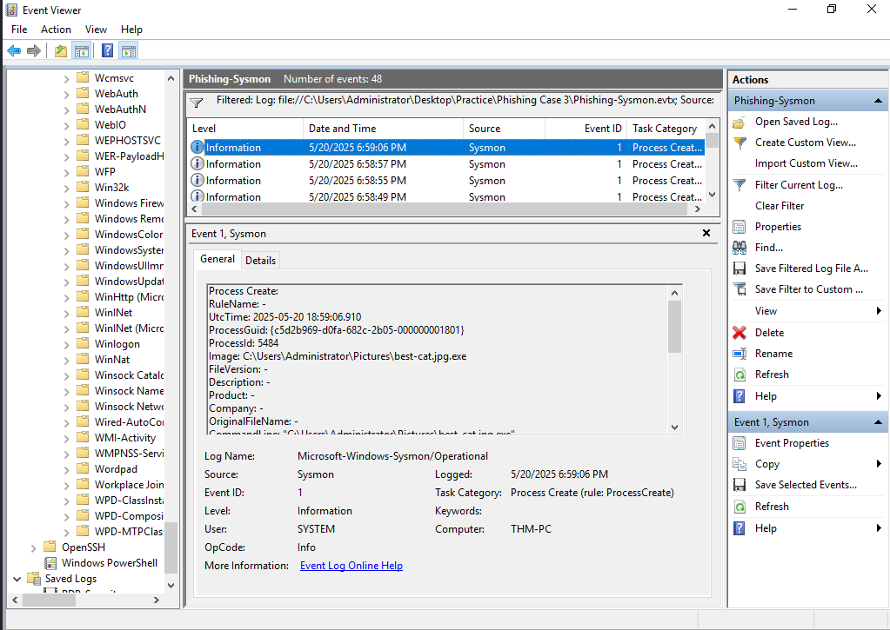
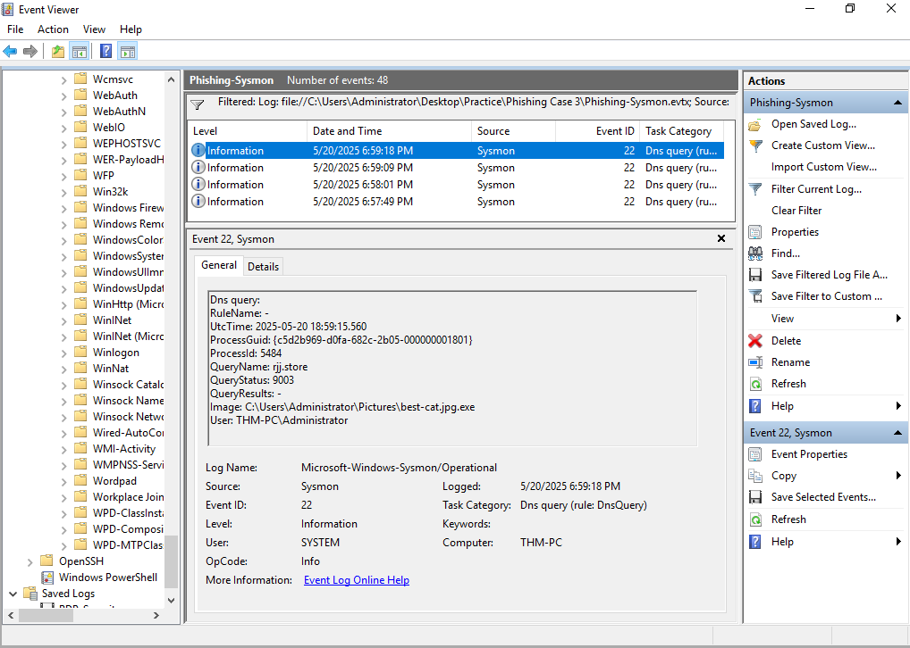

# Windows Threat Detection — Security Event and Sysmon Investigations

## Executive Summary

This project documents nine simulated Windows security investigations focused on detecting and analyzing suspicious activity using Windows Security event logs, Sysmon telemetry, and endpoint process evidence.

The investigations covered initial access, post-compromise discovery, data collection, command-and-control activity, and persistence.

Rather than relying exclusively on individual event IDs or detection alerts, I examined process relationships, command-line arguments, authentication activity, file operations, DNS queries, and Windows configuration changes to understand the behavior represented by each scenario.

The analysis included:

- **Initial access:** RDP authentication attacks, phishing-related executable delivery, and malware execution originating from removable media.
- **Discovery and collection:** Suspicious process trees, system and security-software discovery, clipboard collection, and potential data staging.
- **Command and control:** PowerShell-based payload retrieval, executable launch, and suspicious external communication.
- **Persistence:** Unauthorized local account creation, privileged-group membership changes, Windows service installation, and scheduled-task configuration.

The objective was to identify meaningful security events, correlate related evidence, distinguish attacker intent from confirmed outcomes, and translate the findings into actionable detection opportunities.

These investigations represent separate simulated scenarios grouped into a single defensive security case study. They do not describe one continuous intrusion.

## Investigation Scope

The investigation focused on three categories of Windows security monitoring.

| Category | Scenarios | Primary Focus |
| --- | --- | --- |
| Initial Access | RDP authentication, phishing-related execution, removable-media infection | Detecting suspicious access and initial malware execution |
| Discovery and Collection | Suspicious process ancestry, endpoint discovery, clipboard access, potential file staging | Identifying post-compromise information gathering and collection |
| Command and Control / Persistence | Payload delivery, backdoor accounts, Windows services, scheduled tasks | Investigating attacker communications and durable access mechanisms |

### Investigation Objectives

The analysis sought to answer several recurring questions:

1. What Windows events or process behaviors indicated suspicious activity?
2. Which event fields helped establish the affected user, process, host, or resource?
3. Could process ancestry, timestamps, and related artifacts connect multiple events?
4. Which activities represented confirmed outcomes, and which were only attempted?
5. What additional telemetry would strengthen the investigative conclusions?
6. How could the findings be converted into useful SOC detection logic?

## Evidence Sources and Analysis Methodology

### Evidence Sources

The investigations used Windows endpoint telemetry, including:

- **Windows Security events:** Authentication activity, account creation, and privileged-group membership changes.
- **Sysmon process events:** Process creation, parent-child relationships, and command-line arguments.
- **Sysmon DNS events:** Queries associated with suspicious executable activity.
- **File and configuration artifacts:** Executable paths, staging locations, service configuration, and scheduled-task details.

The specific events and fields varied by scenario. Each finding was evaluated using the evidence available for that investigation.

### Analysis Approach

The investigations followed a consistent process:

| Step | Analyst Activity |
| --- | --- |
| 1. Identify | Locate suspicious events, processes, authentication patterns, or configuration changes |
| 2. Pivot | Examine event IDs, users, process IDs, command lines, and related activity |
| 3. Correlate | Connect events through process ancestry, host context, timestamps, or affected resources |
| 4. Assess | Determine what the evidence establishes and identify plausible attacker objectives |
| 5. Document | Preserve relevant screenshots, indicators, and investigative conclusions |
| 6. Recommend | Identify detection opportunities and additional telemetry that could improve visibility |

### Evidence Standards

The analysis distinguishes between **observed commands**, **confirmed system events**, and **inferred attacker objectives**.

For example, a DNS query does not independently prove successful command-and-control communication or data transfer. Similarly, a process-creation event may show an attempted configuration change without establishing that the requested change succeeded.

Windows Security events confirming account creation or privileged-group membership provide stronger evidence of those specific outcomes.

Where screenshots or logs did not establish the result of an action, the investigation documents the activity without assuming success.

## Investigation Organization

The report is organized by threat behavior rather than by the order in which the training scenarios were completed.

The following sections examine:

1. Initial access through RDP, phishing-related execution, and removable media.
2. Discovery and collection through suspicious Windows process activity.
3. Command-and-control behavior involving PowerShell and external infrastructure.
4. Persistence through local accounts, services, and scheduled tasks.

Each scenario is evaluated independently, with cross-scenario observations reserved for the final detection and defensive-analysis sections.

## Initial Access Detection

### Scenario 1 — Suspicious RDP Authentication

#### Investigation Context

The first scenario involved Windows Remote Desktop Protocol (RDP) authentication activity consistent with a password-guessing attack.

Windows Security logs contained **1,567 failed logon events**, including **1,018 targeting the `ADMINISTRATOR` account**.

The concentration of authentication failures against a privileged account was a significant indicator of potentially automated password guessing.

The investigation focused on identifying the authentication pattern, determining whether any attempts succeeded, and assessing the implications of subsequent remote access.

#### Failed Authentication Analysis

Windows Security Event ID `4625` records a failed logon attempt.

The investigation examined repeated failures and the accounts targeted to understand whether the activity resembled ordinary user error or a coordinated attempt to obtain access.

| Observation | Investigative Significance |
| --- | --- |
| 1,567 failed logon events | High volume of unsuccessful authentication activity |
| 1,018 failures targeting `ADMINISTRATOR` | Concentration of activity against a privileged account |
| Repeated authentication attempts | Pattern consistent with password guessing or brute-force activity |

*Figure 1 — PowerShell aggregation of Windows Security Event ID 4625, showing repeated failed logons targeting administrative and common usernames.*

The number of failed logons alone did not establish the attacker's identity or prove that all attempts originated from one source.

Source addresses, timestamps, logon types, and account names would be useful fields for validating the pattern and distinguishing brute-force attempts from password spraying or other authentication failures.

#### Successful RDP Authentication

Additional Windows Security telemetry identified Event ID `4624`, which records a successful logon.

The observed event included **Logon Type `10`**, indicating a RemoteInteractive logon associated with Remote Desktop Services.

*Figure 2 — Windows Security Event ID 4624 confirming an Administrator RemoteInteractive logon from 203.205.34.107.*

This was an important finding because the investigation contained both unsuccessful authentication attempts and evidence of a successful remote logon.

A successful RDP logon following repeated failures warrants investigation for potential account compromise.

However, a successful logon event does not independently prove that the same actor responsible for the failed attempts obtained access. That relationship requires correlation of account details, source addresses, timestamps, and session context.

#### Analyst Assessment

The combination of high-volume authentication failures, targeting of a privileged account, and successful RDP authentication was consistent with a potential credential-based initial-access incident.

**Assessment:** Suspicious RDP authentication activity requiring investigation for possible unauthorized access.

The evidence supported repeated failed logons and a successful remote-interactive session. Attribution of the successful session to the preceding password-guessing activity would require additional correlation.

#### Detection Opportunities

A useful SOC detection strategy would include:

- Threshold-based alerting on repeated Event ID `4625` failures within a defined period.
- Separate monitoring for high-volume authentication failures targeting privileged accounts.
- Correlation of multiple failed logons followed by Event ID `4624` with Logon Type `10`.
- Comparison of source addresses, account names, and host context to determine whether authentication attempts were related.
- Investigation of unexpected RDP access from unfamiliar sources or outside approved access windows.

These detections should account for legitimate administrative activity and authentication misconfigurations to minimize false positives.

### Scenario 2 — Phishing-Related Executable Execution

#### Investigation Context

The second scenario involved suspicious executable activity associated with a phishing-related initial-access attempt.

The investigation used Windows endpoint telemetry to examine how the executable was launched and whether subsequent behavior suggested malicious activity.

The focus was on correlating process execution with network indicators rather than treating the executable's presence as proof of compromise.

#### Suspicious Process Execution

Sysmon process telemetry identified executable activity associated with the suspected phishing scenario.

The investigation examined the executable's path, process context, and available command-line information to determine whether the behavior was consistent with legitimate user activity.

Process-creation evidence was particularly useful because it helped establish that the suspicious file was executed, rather than merely downloaded or stored.

The process evidence also provided a starting point for investigating subsequent network activity.

*Figure 3 — Sysmon Event ID 1 showing execution of `C:\Users\Administrator\Pictures\best-cat.jpg.exe` (PID 5484), a double-extension executable associated with the simulated phishing scenario.*

#### DNS Activity

Additional Sysmon telemetry recorded DNS-related activity associated with the suspicious executable.

Correlating the executable with its DNS queries helped establish the relationship between local process execution and attempted external communication.

A DNS query alone does not prove that a remote connection was successfully established or that command-and-control traffic was exchanged.

However, unexpected DNS activity originating from a suspicious executable provides an important indicator for further investigation.

*Figure 4 — Sysmon Event ID 22 recording a DNS query for `rj.store` from `best-cat.jpg.exe` (PID 5484). QueryStatus 9003 indicates the name was not resolved.*

#### Analyst Assessment

The combination of suspicious executable activity and associated DNS queries was consistent with possible malware execution following a phishing-related initial-access attempt.

**Assessment:** Suspicious execution and external communication requiring investigation.

The evidence supported the presence of process and DNS activity, but did not independently establish successful command-and-control communication or the full impact of the executable.

#### Detection Opportunities

- Alert on suspicious executables launched from user-writable locations.
- Correlate unusual process execution with subsequent DNS activity.
- Investigate unexpected executables associated with phishing-related alerts.
- Review parent-child process relationships and execution paths.
- Prioritize processes contacting unusual external domains shortly after execution.